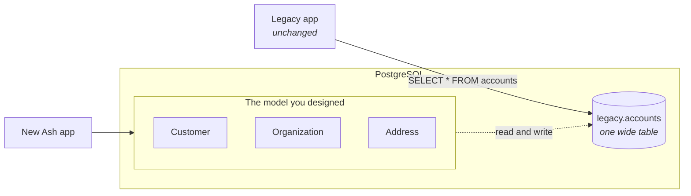
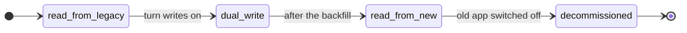
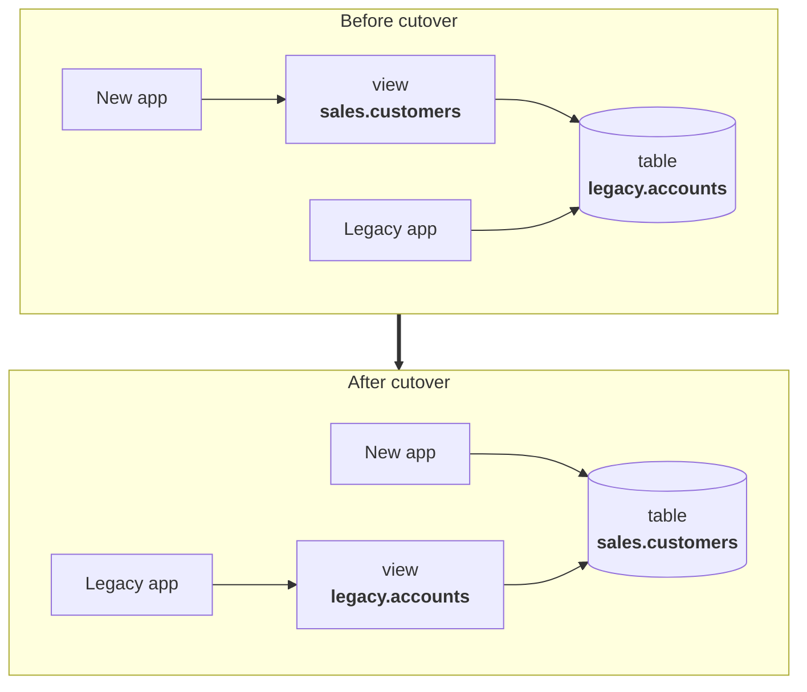

<!--
SPDX-FileCopyrightText: 2026 Luke Galea

SPDX-License-Identifier: MIT
-->

# AshStrangler

**Adopt the schema you should have had — without stopping the application you already have.**

[](https://github.com/lukegalea/ash_strangler/actions/workflows/elixir.yml)
[](LICENSE)
[](#documentation)

---

## The situation

Your database grew a column at a time. Nobody designed it; it accreted. One
`accounts` table holds a person, their employer, and their address. The lifecycle
lives in four columns that can contradict each other — `is_active`, `is_deleted`,
`approved_at`, `cancelled_at` — and three of them are usually wrong.

You know what the model *should* be. Maybe you have worked it out top-down, maybe
you are adopting a published domain model like the
[Microsoft Common Data Model](https://learn.microsoft.com/en-us/common-data-model/)
rather than inventing nouns again. Either way it is not a rename away — it is a
different **shape**: separate resources with real relationships, one lifecycle
governed by a state machine, proper types.

You cannot stop the world to get there. The old application has to keep working
for the eighteen months it takes, and you need to back out at any point, because
somebody is on call throughout.

**AshStrangler lets both schemas exist over the same rows at once** — the old one
for the old application, the one you actually designed for the new.



One legacy table, three well-modelled resources, the same rows. Neither
application knows the other exists.

## The idea in thirty seconds

**The pattern has two names.** *Strangler fig* is the metaphor: the fig seeds in
the canopy of a host tree and grows down around it until it is self-supporting and
the host can be removed — you grow the replacement *around* the original instead of
rewriting in one jump. **Expand/contract** (also called parallel change) is the
formal name for the database technique: *expand* the schema so old and new shapes
coexist, migrate readers and writers across, then *contract* by removing the old.
It is the same pattern [pgroll](https://github.com/xataio/pgroll) and
[Reshape](https://github.com/fabianlindfors/reshape) implement, and the phases
below are its three steps with the middle one split in two.

**Views can be written to.** This is the part most people have not run into. A
PostgreSQL view is usually described as "a saved query", which makes it sound
read-only. It is not:

- A **simple view** — one table, no aggregates — is *automatically updatable*.
  `UPDATE users SET email = …` against the view just works. Free.
- A **view that reshapes data** — renaming columns, turning `'active'` into `0`,
  joining `first_name` and `last_name` — becomes writable with an `INSTEAD OF`
  trigger: a function saying "when someone writes this view, here is what to do to
  the real table."

Put those together and a view is a **two-way adapter** between the schema you have
and the schema you want.

**You move across in phases**, and you decide when each one happens:



Each step is a one-word edit and a generated migration, and every one but the last
is reversible.

---

## Show me

Here is the interesting half of a re-model: **four legacy columns become one
lifecycle**, and the wide table becomes more than one resource.

```elixir
defmodule MyApp.Sales.Customer do
  use Ash.Resource,
    domain: MyApp.Sales,
    data_layer: AshPostgres.DataLayer,
    extensions: [AshStrangler.Resource, AshStateMachine]

  postgres do
    table "customers"      # the VIEW this creates
    schema "sales"
    repo MyApp.Repo
    migrate? false         # Ash owns the view, not the legacy table
  end

  attributes do
    attribute :id, :uuid, primary_key?: true, allow_nil?: false, writable?: false
    attribute :email, :ci_string, allow_nil?: false, public?: true
    attribute :full_name, :string, public?: true
    attribute :status, :atom, public?: true
  end

  # An ordinary state machine. It does not know or care that the data
  # underneath is four booleans in a table from 2011.
  state_machine do
    initial_states [:pending]
    default_initial_state :pending

    transitions do
      transition :approve, from: :pending, to: :active
      transition :cancel,  from: [:pending, :active], to: :cancelled
      transition :archive, from: :*, to: :archived
    end
  end

  strangler do
    phase :read_from_legacy

    source "legacy.accounts" do
      # Legacy has integer ids and you want UUIDs. Derived deterministically,
      # so there is no lookup table and no join.
      key :id, from: "id", strategy: {:uuid_v5, namespace: "6b1e8b2c-6f6d-4a4a-9f1a-5b0e0d3c4a71"}

      map :email, "email", cast: :citext

      map :full_name do
        from "coalesce(first_name,'') || ' ' || coalesce(last_name,'')"
        writable? false
        because "Not decomposable: 'de la Cruz' splits wrong, and no rule fixes it."
      end

      # Four columns that could always contradict each other, collapsed into
      # one value. Most-terminal first, so the projection is a total function
      # over rows the old app was never stopped from writing.
      map :status do
        from """
        CASE
          WHEN is_deleted            THEN 'archived'
          WHEN cancelled_at IS NOT NULL THEN 'cancelled'
          WHEN approved_at  IS NOT NULL THEN 'active'
          ELSE 'pending'
        END
        """

        writable? false
        because "Four legacy columns with no single inverse. Supply `to:`/`into:` before enabling dual-write."
      end
    end
  end
end
```

The employer buried in the same table becomes its own resource, with its own
view over the same rows:

```elixir
defmodule MyApp.Sales.Organization do
  # ...same postgres/extensions preamble...

  strangler do
    phase :read_from_legacy

    source "legacy.accounts" do
      key :id, from: "id", strategy: {:uuid_v5, namespace: "6b1e8b2c-…"}

      map :name, "company_name"
      map :vat_number, "company_vat"
    end
  end
end
```

Then:

```bash
mix ash_strangler.check          # does the legacy DATA satisfy your new model?
mix ash_strangler.gen.migration  # generate the compatibility layer
mix ecto.migrate
```

You now have `Customer` and `Organization` as real Ash resources — reads,
filters, relationships, policies, a state machine — over a table you did not
design and are not yet allowed to change.

> [!NOTE]
> Each resource maps **one** legacy relation. Splitting a wide table into several
> resources works today; composing several legacy tables into one resource
> (a join) does not yet.

<details>
<summary><b>The SQL it generated for <code>Customer</code></b></summary>

```sql
CREATE OR REPLACE VIEW "sales"."customers" AS
SELECT
  uuid_generate_v5('6b1e8b2c-…'::uuid, 'legacy.accounts:' || id::text)  AS id,
  id                                                                    AS __legacy_id,
  (email)::citext                                                       AS email,
  coalesce(first_name,'') || ' ' || coalesce(last_name,'')              AS full_name,
  CASE
    WHEN is_deleted            THEN 'archived'
    WHEN cancelled_at IS NOT NULL THEN 'cancelled'
    WHEN approved_at  IS NOT NULL THEN 'active'
    ELSE 'pending'
  END                                                                   AS status
FROM legacy.accounts;

-- Without this, every Ash.get/2 is a sequential scan.
CREATE INDEX IF NOT EXISTS strangler_customers_key_idx ON legacy.accounts
  (uuid_generate_v5('6b1e8b2c-…'::uuid, 'legacy.accounts:' || id::text));
```

</details>

---

## Declare the mapping, derive everything else

This is the Ash bargain, applied one layer lower.

In Ash you describe *what* a resource is and the framework derives the rest — the
queries, the changesets, the API, the policies. You do not hand-write the
plumbing, so the plumbing cannot drift from the description.

A schema migration normally has no such description. The mapping between old and
new lives in four places at once — a migration, a trigger function, an
application model, and a runbook — and nothing keeps them agreeing. They drift,
quietly, and the first symptom is wrong data.

AshStrangler makes that mapping a **declaration**, and derives the compatibility
view, the triggers, the index, the backfill, the reconciler and the notification
bridge from it. One description, one source of truth.

### The contract is checked before it runs

The mapping is a contract between two schemas, and because it is declared rather
than hand-written, **the compiler can check that contract is satisfiable** — before
a single statement reaches a database.

That is the actual product. Not the SQL: the SQL is forty lines and you could
write it. What you cannot do by hand is *prove* that every attribute your new model
declares is actually derivable from the old one, that every value the new model
writes can be translated back, and that nothing in the projection is ambiguous.

So it will not compile a mapping where:

- an attribute has **no legacy source** — the view would read `NULL` for it forever,
  and nothing would raise;
- a computed value **claims to be writable** but cannot be inverted;
- an `identity` rests on a **uniqueness the database does not enforce**, which
  would have Ash planning upserts against a constraint that is not there;
- a timestamp projection is **not deterministic**, because a naive column cast
  without a stated zone reads differently on different connections;
- a mapping would **silently cost you upserts** by forcing a trigger where the
  view could have stayed auto-updatable.

Each refusal names the mapping responsible and what it would have cost, so the
error is a next step rather than a puzzle.

→ [Every check, and the failure it prevents](documentation/topics/what-it-refuses.md)

> [!WARNING]
> `ash_authentication`'s `oauth2` and `oidc` strategies **cannot** be defined
> without an upsert, so they are mutually exclusive with the trigger path. The
> `password` strategy is fine — the common case for a legacy monolith.

---

## The phases in full

| | `:read_from_legacy` | `:dual_write` | `:read_from_new` | `:decommissioned` |
|---|---|---|---|---|
| **Source of truth** | legacy tables | legacy tables | the new table | the new table |
| **New app** | reads | reads and writes | owns the data | owns the data |
| **Old app** | unchanged | unchanged | **still unchanged** | switched off |
| **Rollback** | drop the view | drop the triggers | reverse the views | one-way |

At `:read_from_new` the view **flips** — and the name flips with it:



The old application still runs `SELECT * FROM accounts` and has no idea
`accounts` stopped being a table. **Cutover is a migration, not a coordinated deploy of two
systems** — which is the most valuable thing here.

→ [The phase model in full](documentation/topics/phases.md)

---

## The rest of the toolkit

| | |
|---|---|
| **`mix ash_strangler.check`** | Runs your new model's assertions against the *legacy data* before you generate anything. NULLs where you declared `allow_nil? false`? Duplicates under your new identity? Values that will not cast? |
| **Backfill** | Batched and resumable, built not to take the database down: keyset pagination, one transaction per batch, and a flag column rather than a predicate that cannot terminate. |
| **Reconciler** | Counts and per-batch checksums across both shapes, with per-column normalization — because Ash's own types transform values on write, and without that the first run is a wall of false positives. |
| **Notifications** | Legacy writes become real `Ash.Notifier.Notification`s, re-read through Ash so calculations, policies and tenancy apply. Your LiveViews update when the *old* app writes. |

---

## Installation

```elixir
def deps do
  [{:ash_strangler, "~> 0.1"}]
end
```

Then add `:ash_strangler` to `import_deps` in `.formatter.exs`, or let the
installer do it:

```bash
mix igniter.install ash_strangler
```

Requires PostgreSQL 14+ and `ash_postgres`.

---

## Documentation

- [How it works](documentation/topics/how-it-works.md) — the mechanism from first principles
- [The phase model](documentation/topics/phases.md) — what each phase generates, and how to move
- [What it refuses to generate](documentation/topics/what-it-refuses.md) — every check and the failure it prevents
- [Backfill and reconciliation](documentation/topics/backfill-and-reconciliation.md)
- [Notifications](documentation/topics/notifications.md)
- [DSL reference](documentation/dsls/DSL-AshStrangler.Resource.md)
- [`usage-rules.md`](usage-rules.md) — rules for AI coding agents editing a mapping

## Status

**Alpha (0.1).** All four phases generate SQL that is executed and tested against a
real PostgreSQL server, including a full migrate → rollback → migrate cycle. The
DSL will still change — pin an exact version. See [CHANGELOG.md](CHANGELOG.md).

> [!NOTE]
> If your new schema lives in a **different database**, this is the wrong tool —
> that is change data capture, and [Debezium](https://debezium.io/),
> [walex](https://github.com/agoodway/walex) or
> [ash_replicant](https://hex.pm/packages/ash_replicant) are what you want. Every
> guarantee here rests on there being one database, and therefore one transaction.

## Contributing

Issues and pull requests welcome. The suite runs against a real PostgreSQL: `mix
test` with a server on `localhost:5432`, or set `DB_HOST` and `PGPORT`.

## License

MIT.
