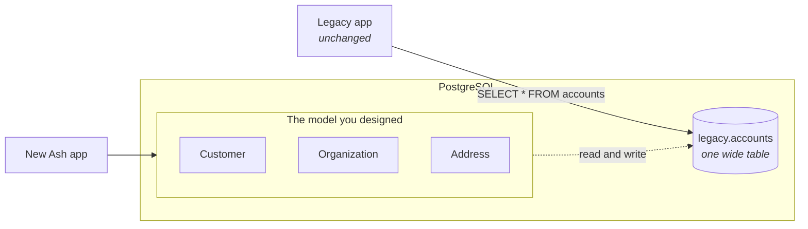
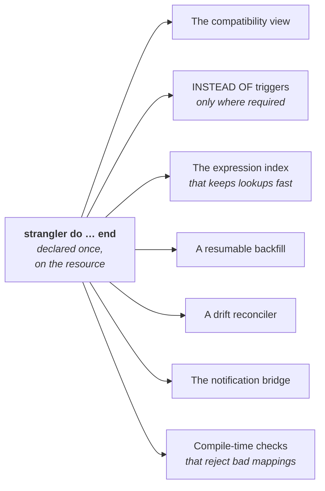
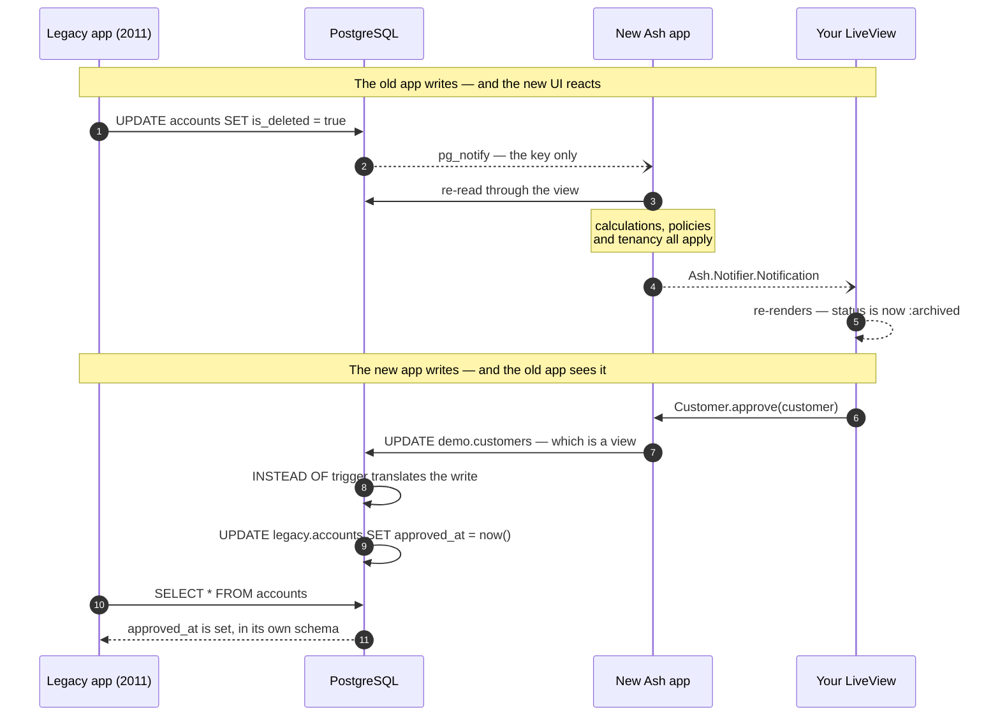
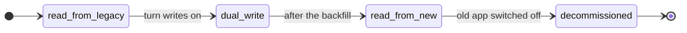
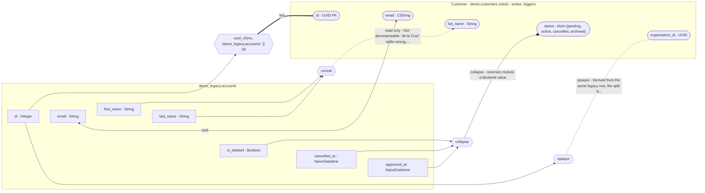
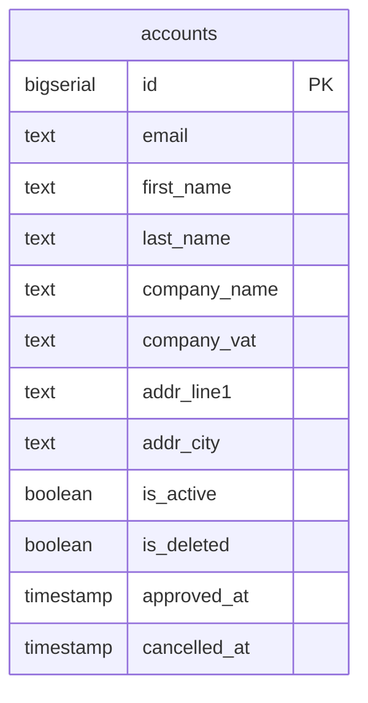
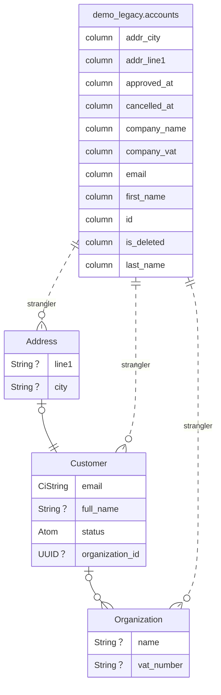
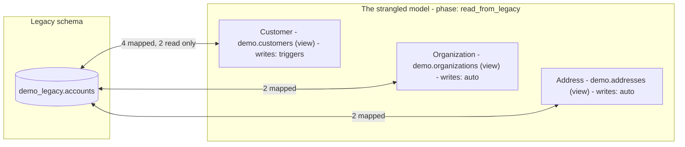
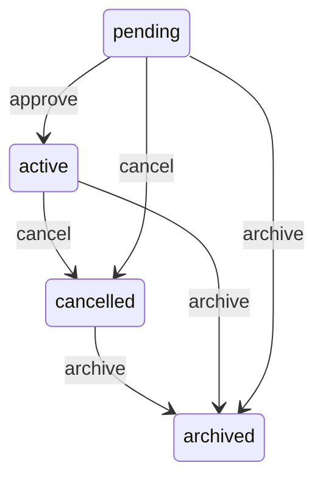
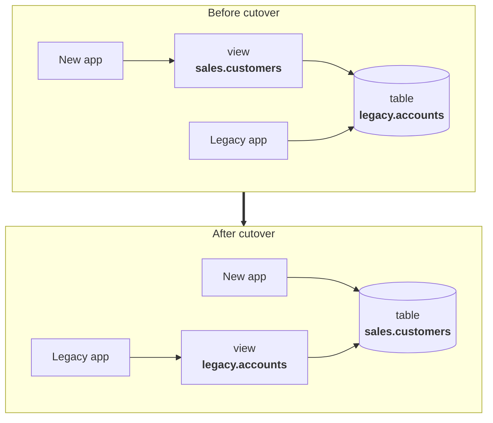

<!--
SPDX-FileCopyrightText: 2026 Luke Galea

SPDX-License-Identifier: MIT
-->

# AshStrangler

**Adopt the schema you should have had — without stopping the application you already have.**

[](https://github.com/lukegalea/ash_strangler/actions/workflows/elixir.yml)
[](LICENSE)
[](#documentation)

---

## The situation

Your database grew a column at a time. Nobody designed it; it accreted. One
`accounts` table holds a person, their employer, and their address. The lifecycle
lives in four columns that can contradict each other — `is_active`, `is_deleted`,
`approved_at`, `cancelled_at` — and three of them are usually wrong.

You know what the model *should* be. Maybe you have worked it out top-down, maybe
you are adopting a published domain model like the
[Microsoft Common Data Model](https://learn.microsoft.com/en-us/common-data-model/)
rather than inventing nouns again. Either way it is not a rename away — it is a
different **shape**: separate resources with real relationships, one lifecycle
governed by a state machine, proper types.

You cannot stop the world to get there. The old application has to keep working
for the eighteen months it takes, and you need to back out at any point, because
somebody is on call throughout.

**AshStrangler lets both schemas exist over the same rows at once** — the old one
for the old application, the one you actually designed for the new.



One legacy table becomes three well-modelled resources; several legacy tables can
just as easily become one. Neither application knows the other exists.

And because both are writing to the same rows, **the new application can be live
from day one**. A write from the fifteen-year-old app becomes a real
`Ash.Notifier.Notification` — re-read through Ash, so calculations, policies and
tenancy all apply — which means your new LiveViews update in real time in
response to writes made by the *old* system. You get the modern experience
before you have migrated anything.

## Declare it once, derive the rest

This is the Ash bargain, applied one layer lower.

In Ash you describe *what* a resource is and the framework derives the rest — the
queries, the changesets, the API, the policies. You do not hand-write the
plumbing, so the plumbing cannot drift from the description.

A schema migration normally has no such description. The mapping between the old
shape and the new one lives in four places at once — a migration, a trigger
function, an application model, and a runbook — and nothing keeps them agreeing.
They drift, quietly, and the first symptom is wrong data.

So the mapping becomes **one declaration**, and everything else is derived from
it:



One description, one source of truth, and nothing to keep in sync by hand.

## What that gets you: both directions, live

Once that declaration exists, the two applications are genuinely running
together — not one migrating toward the other. Writes flow both ways, and the new
application is reactive from the first day:



Neither side was modified to make that work. The old application still issues the
SQL it always did; the new one writes ordinary Ash actions against ordinary Ash
resources. A database view and its triggers sit in between, translating in both
directions — [yes, PostgreSQL views can be written to](#the-idea-in-thirty-seconds),
which is the trick the whole thing rests on — and the notification bridge closes
the loop, so a change made by fifteen-year-old code lands in a LiveView you wrote
last week.

### The contract is checked before it runs

The mapping is a contract between two schemas, and because it is declared rather
than hand-written, **the compiler can check that contract is satisfiable** — before
a single statement reaches a database.

That is the actual product. Not the SQL: the SQL is forty lines and you could
write it. What you cannot do by hand is *prove* that every attribute your new model
declares is actually derivable from the old one, that every value the new model
writes can be translated back, and that nothing in the projection is ambiguous.

So it will not compile a mapping where:

- an attribute has **no legacy source** — the view would read `NULL` for it forever,
  and nothing would raise;
- a transform has **no inverse** and does not say so, so a write would silently not
  propagate;
- a value table is **not total** — it decodes four of the five values the column
  actually holds, and the fifth reads as nothing. The tempting fix, a catch-all
  `ELSE`, is refused by name, because a value that is *wrong* is worse than a value
  that is absent;
- a value table is **not injective**, so reading a row and writing it back
  unchanged rewrites it. The error prints the counterexample, not a verdict;
- an attribute admits values **no legacy encoding exists for**, which is how
  `state_code: 7` came to be stored as `'suspended'` and read back as `1`;
- a decision table has a **missing rule** — some combination of guards no clause
  matches — or a clause **no input can ever reach**;
- two mappings **write the same legacy column**, where declaration order silently
  decides which one wins;
- an `identity` rests on a **uniqueness the database does not enforce**, which
  would have Ash planning upserts against a constraint that is not there;
- a declared transform **is the identity**, which is a claim that something happens
  written where a reader will believe it — and it costs a real mechanism;
- a `zone:` is applied to a column that is **already time-zone aware**, where
  `AT TIME ZONE` would strip the zone it was meant to establish;
- a column reached **through a relationship claims to be writable**, when
  nothing identifies which row over there it would write to.

Each refusal names the mapping responsible and what it would have cost, so the
error is a next step rather than a puzzle. Where an obligation cannot be decided at
compile time — a value space with no declared bounds, an escape into raw SQL — the
*same* obligation is re-emitted as SQL and `mix ash_strangler.check` measures it
against the real legacy data. Proven, or measured. Never asserted.

→ [Every check, and the failure it prevents](documentation/topics/what-it-refuses.md)

> [!WARNING]
> `ash_authentication`'s `oauth2` and `oidc` strategies **cannot** be defined
> without an upsert, so they are mutually exclusive with the trigger path. The
> `password` strategy is fine — the common case for a legacy monolith.

---

---

## The idea in thirty seconds

**The pattern has two names.** *Strangler fig* is the metaphor: the fig seeds in
the canopy of a host tree and grows down around it until it is self-supporting and
the host can be removed — you grow the replacement *around* the original instead of
rewriting in one jump. **Expand/contract** (also called parallel change) is the
formal name for the database technique: *expand* the schema so old and new shapes
coexist, migrate readers and writers across, then *contract* by removing the old.
It is the same pattern [pgroll](https://github.com/xataio/pgroll) and
[Reshape](https://github.com/fabianlindfors/reshape) implement, and the phases
below are its three steps with the middle one split in two.

**Views can be written to.** This is the part most people have not run into. A
PostgreSQL view is usually described as "a saved query", which makes it sound
read-only. It is not:

- A **simple view** — one table, no aggregates — is *automatically updatable*.
  `UPDATE users SET email = …` against the view just works. Free.
- A **view that reshapes data** — renaming columns, turning `'active'` into `0`,
  joining `first_name` and `last_name` — becomes writable with an `INSTEAD OF`
  trigger: a function saying "when someone writes this view, here is what to do to
  the real table."

Put those together and a view is a **two-way adapter** between the schema you have
and the schema you want.

**And the updatability rule is per column, not per view.** This is the paragraph of
the `CREATE VIEW` manual page that changes how a real migration is sequenced:

> A column is updatable if it is a **simple reference to an updatable column of the
> underlying base relation**; otherwise the column is read-only, and an error will be
> raised if an `INSERT`, `UPDATE`, or `MERGE` statement attempts to assign a value to
> it.

So a view may hold a **mix** of updatable and read-only columns. A computed column
does not force a trigger — it errors only if something assigns to it. Measured on
PostgreSQL 17.10, a view with two plain references and two computed columns and no
triggers keeps `UPDATE` of the plain ones, upserts, `RETURNING` *and*
`WITH CHECK OPTION`; the same view with an `INSTEAD OF` trigger loses all three.
**Those are lost to the trigger, not to the computation**, which is why
`AshStrangler` classifies each column separately and picks the weakest mechanism
that works.

**You move across in phases**, and you decide when each one happens:



Each step is a one-word edit and a generated migration, and every one but the last
is reversible.

---

## Show me

Two modules, because the legacy schema *is* a schema and Ash already has a way to
describe one.

First the **twin**: the legacy relation, declared as an ordinary read-only
resource. You do not type this — `mix ash_strangler.gen.twin` reads it out of the
database, including the unique indexes and the `CHECK ... IN (...)` constraints
that tell it a text column holds one of five values.

```elixir
# generated by `mix ash_strangler.gen.twin --relation legacy.accounts`
defmodule MyApp.Legacy.Accounts do
  use Ash.Resource,
    domain: MyApp.Legacy,
    data_layer: AshPostgres.DataLayer,
    extensions: [AshStrangler.Twin]

  postgres do
    table "accounts"
    schema "legacy"
    repo MyApp.Repo
    migrate? false           # we do not own this table and never will
  end

  attributes do
    attribute :id, :integer, primary_key?: true, allow_nil?: false
    attribute :email, :string
    attribute :first_name, :string
    attribute :last_name, :string
    attribute :is_deleted, :boolean
    attribute :approved_at, :naive_datetime
    attribute :cancelled_at, :naive_datetime
  end
end
```

That one move is what makes everything below **typed**. `expr(first_name)` now
resolves to a real column of a known type, so the cast is derived rather than
declared, the lineage is a fact rather than a guess, and a typo in a column name
is a compile error rather than something PostgreSQL mentions in eighteen months.

Then the interesting half of a re-model: **four legacy columns become one
lifecycle**, and the wide table becomes more than one resource.

```elixir
defmodule MyApp.Sales.Customer do
  use Ash.Resource,
    domain: MyApp.Sales,
    data_layer: AshPostgres.DataLayer,
    extensions: [AshStrangler.Resource, AshStateMachine]

  postgres do
    table "customers"      # the VIEW this creates
    schema "sales"
    repo MyApp.Repo
    migrate? false         # Ash owns the view, not the legacy table
  end

  attributes do
    attribute :id, :uuid, primary_key?: true, allow_nil?: false, writable?: false
    attribute :email, :ci_string, allow_nil?: false, public?: true
    attribute :full_name, :string, public?: true
    attribute :status, :atom, public?: true
  end

  # An ordinary state machine. It does not know or care that the data
  # underneath is four booleans in a table from 2011.
  state_machine do
    initial_states [:pending]
    default_initial_state :pending

    transitions do
      transition :approve, from: :pending, to: :active
      transition :cancel,  from: [:pending, :active], to: :cancelled
      transition :archive, from: :*, to: :archived
    end
  end

  strangler do
    phase :read_from_legacy

    source MyApp.Legacy.Accounts do
      # Legacy has integer ids and you want UUIDs. Derived deterministically,
      # so there is no lookup table and no join.
      key :id, from: :id, strategy: {:uuid_v5, namespace: "6b1e8b2c-6f6d-4a4a-9f1a-5b0e0d3c4a71"}

      # No cast. The twin says `email` is text and the attribute says it is
      # `:ci_string`, so `(email)::citext` is derived from those two facts.
      map :email, from: :email

      concat :full_name,
        from: [:first_name, :last_name],
        separator: " ",
        read_only?: true,
        because: "Not decomposable: 'de la Cruz' splits wrong, and no separator fixes it."

      # Four columns that could always contradict each other, collapsed into
      # one value — and back. Each clause carries a forward guard AND the
      # backward assignment, so the reverse is total by construction rather
      # than something you write a second time and hope matches.
      collapse :status do
        hit_policy :first

        state :archived,
          when: expr(is_deleted),
          set: [is_deleted: true, cancelled_at: nil, approved_at: nil]

        state :cancelled,
          when: expr(not is_nil(cancelled_at)),
          set: [is_deleted: false, cancelled_at: touch(), approved_at: nil]

        state :active,
          when: expr(not is_nil(approved_at)),
          set: [is_deleted: false, cancelled_at: nil, approved_at: touch()]

        # `:otherwise` is what makes the projection total over rows the old
        # application was never stopped from writing. Without it, the compiler
        # tells you which combination of guards has no clause.
        state :pending,
          when: :otherwise,
          set: [is_deleted: false, cancelled_at: nil, approved_at: nil]
      end
    end
  end
end
```

Note what is **not** in there: no SQL, no second hand-written inverse, no
`writable?` claim. There is one declaration per mapping, and both directions come
out of it — which is the only way they cannot disagree.

### And here is what that mapping actually does

The mapping is the one part of this everybody has to agree about and nobody can
hold in their head. It is already declared in one place, so it can be **drawn**
from that declaration — `mix ash_strangler.gen.diagram` renders the block above,
not a picture of it:



Three columns converge on one hexagon and come out as `status`; that is the
lifecycle collapse, drawn. Every mark in it is **computed from the mapping's
classification** rather than chosen by a diagram generator — the same
classification that decides whether a value may be written back, so the picture
and the write path cannot disagree about a mapping:

| Mark | Means | Computed from |
|---|---|---|
| rectangle | a legacy column, **with its type** | a twin attribute |
| stadium | a resource attribute | an Ash attribute |
| hexagon | a transform, labelled with the **combinator** | `lens.combinator` |
| `==>` | structural: the key, or a constant with no legacy source | `type: :structural` |
| `<-->` | the value travels both ways | `invertible: :yes` |
| `--o` | travels back *modulo* a default, a separator or a `touch()` | `invertible: :semi` |
| `-.->` | read-only, labelled with the mapping's own `because:` | `type: :masked` |
| `-.-` | opaque: raw SQL, proven neither way | `opaque?: true` |
| `-->` | a column feeding a transform | — |

The vocabulary is OpenLineage's `columnLineage` facet rather than one invented
here, which is why `mix ash_strangler.gen.diagram --format json` produces something
existing lineage tooling can read. For a tool whose job is proving to somebody that
nothing was lost, that is the point rather than a nicety.

Two things are worth noticing about what the diagram *cannot* show. There is no
"source columns not resolved" node, because lineage is read off the expression that
was built rather than guessed out of a string — so there is no inference left to
fail. And `--o` on `status` is not a hedge: a `collapse` carrying `touch()` cannot
recover the original timestamp when a state round-trips, and the notation says so
rather than letting you find out.

The employer buried in the same table becomes its own resource, over the same twin
and therefore the same rows:

```elixir
defmodule MyApp.Sales.Organization do
  # ...same postgres/extensions preamble...

  strangler do
    phase :read_from_legacy

    source MyApp.Legacy.Accounts do
      key :id, from: :id, strategy: {:uuid_v5, namespace: "6b1e8b2c-…"}

      map :name, from: :company_name
      map :vat_number, from: :company_vat
    end
  end
end
```

Then:

```bash
mix ash_strangler.check          # does the legacy DATA satisfy your new model?
mix ash_strangler.gen.migration  # generate the compatibility layer
mix ecto.migrate
```

You now have `Customer`, `Organization` and `Address` as real Ash resources —
reads, filters, relationships, policies, a state machine — over a table you did
not design and are not yet allowed to change.

And a resource can gather columns the old schema scattered — by declaring the
relationship **on the twin**, where a relationship belongs:

```elixir
# on the twin
relationships do
  has_one :address, MyApp.Legacy.Addresses do
    source_attribute :id
    destination_attribute :account_id
  end
end

# on the resource
source MyApp.Legacy.Accounts do
  key :id, from: :id, strategy: {:uuid_v5, namespace: "6b1e8b2c-…"}

  map :email, from: :email

  map :city,
    from: expr(address.city),
    read_only?: true,
    because: "Read through a relationship; write it through its own resource."
end
```

The join condition is derived from the relationship, so there is no SQL predicate
to get wrong and a **cross join is not expressible** — a join with no condition
multiplies every row by every row and is never what anyone meant.

Two consequences fall out of that rather than being defaults you could change.
The join is always `LEFT`: a relationship describes which rows *relate*, not which
rows survive, and an `INNER JOIN` would **remove** rows the old application can
still see with nothing anywhere reporting it. And a `has_many` is refused by
name — it would multiply view rows, so one legacy account with three addresses
would become three `Customer` records where the old application had one.

Columns reached through a relationship are read-only: writes go back through
`__legacy_id`, which identifies a row in the primary relation and nothing in a
joined one.

<details>
<summary><b>The SQL it generated for <code>Customer</code></b></summary>

Rendered by one printer from one declaration — the same printer the triggers, the
reverse view, the index and the reconciler use, through different reference frames.
That is not tidiness: when the *index* expression drifts from the *query*
expression, PostgreSQL silently stops using the index, and the only symptom is a
sequential scan at production data volumes.

```sql
CREATE OR REPLACE VIEW "sales"."customers" AS
SELECT
  uuid_generate_v5('6b1e8b2c-…'::uuid, 'legacy.accounts:' || id::text) AS id,
  id AS __legacy_id,
  (email)::citext AS email,
  ((coalesce(first_name, '') || ' ') || coalesce(last_name, '')) AS full_name,
  (CASE WHEN is_deleted THEN 'archived' ELSE (CASE WHEN (cancelled_at IS NOT NULL) THEN 'cancelled' ELSE (CASE WHEN (approved_at IS NOT NULL) THEN 'active' ELSE 'pending' END) END) END) AS status
FROM legacy.accounts;

-- Without this, every Ash.get/2 is a sequential scan.
CREATE INDEX IF NOT EXISTS strangler_customers_key_idx ON legacy.accounts
  (uuid_generate_v5('6b1e8b2c-…'::uuid, 'legacy.accounts:' || id::text));
```

The `coalesce`s in `full_name` are not decoration: SQL's `||` propagates NULL, so
without them one absent `last_name` would blank the whole value and the attribute
would read as nothing for that row.

And the write direction — which in 0.1 was a *second SQL string you typed by hand*
that nothing compared to the first. Every assignment below is the same `collapse`
read backwards, so there is nothing to keep in step:

```sql
UPDATE legacy.accounts
SET is_deleted   = (CASE NEW.status WHEN 'archived' THEN TRUE WHEN 'cancelled' THEN FALSE WHEN 'active' THEN FALSE ELSE FALSE END),
    cancelled_at = (CASE NEW.status WHEN 'archived' THEN NULL WHEN 'cancelled' THEN (CASE WHEN OLD.status IS DISTINCT FROM NEW.status THEN now() ELSE cancelled_at END) WHEN 'active' THEN NULL ELSE NULL END),
    approved_at  = (CASE NEW.status WHEN 'archived' THEN NULL WHEN 'cancelled' THEN NULL WHEN 'active' THEN (CASE WHEN OLD.status IS DISTINCT FROM NEW.status THEN now() ELSE approved_at END) ELSE NULL END)
WHERE id = OLD.__legacy_id;
```

Notice that the backward direction does not mirror the forward guards. Forward, a
clause is chosen by a predicate over legacy columns; backward, it is chosen by the
attribute's own value — a literal — so the whole thing is one flat `CASE`. That is
what makes the reverse **total and canonical**: `set:` names every column the table
touches, and the attribute's value selects exactly one row of it.

`touch()` is what produced the inner `CASE`s: write `now()` only on an actual
transition, and otherwise preserve what is stored, read straight out of the bare
column name. That is what real triggers do, and it is the one place this design
admits it loses information — round-tripping `:cancelled` cannot recover the
original instant, so the DSL makes you name the loss instead of discovering it.

</details>

---

## What that actually bought you

The pictures below are **generated from the resources above**, not drawn to
resemble them.

**Before** — the legacy shape, all of it one table:



Three concepts and a lifecycle, flattened into twelve columns with no
relationships and four flags that can disagree with each other.

**After** — the model, as `ash_diagram` renders it from the resources:



Separate entities, real relationships, typed attributes — over exactly the same
rows, with the old application still running against them untouched.

The legacy table is in that picture because `AshStrangler.Resource` implements
`ash_diagram`'s extension hook, so a strangled resource carries its source into
*any* diagram drawn of the application — including the ones `mix
ash.generate_resource_diagrams` and [Clarity](https://hex.pm/packages/clarity)
produce, neither of which knows this package exists. For as long as the
migration runs, the old table is part of the data model, and a diagram that
leaves it out is describing a system that does not exist yet. Only the columns
the mapping actually names appear: `is_active` is absent because nothing reads
it, which is the sort of thing you want to find out from a picture.

And the same three resources, from further back — one table, three views, which
way writes flow, and how far along each one is:



That is `mix ash_strangler.gen.diagram --type overview`, and it is the one that
stays readable for a whole application.

**And the lifecycle**, as `ash_state_machine` renders it — four contradictory
columns turned into a machine that can be reasoned about:



That is the whole pitch in three pictures. The middle one is what you get to
build against on day one; the first one is what is still on disk; the last is a
guarantee you did not previously have, because `is_active = true` and
`is_deleted = true` used to be a state the database would happily store.

---

## The phases in full

| | `:read_from_legacy` | `:dual_write` | `:read_from_new` | `:decommissioned` |
|---|---|---|---|---|
| **Source of truth** | legacy tables | legacy tables | the new table | the new table |
| **New app** | reads | reads and writes | owns the data | owns the data |
| **Old app** | unchanged | unchanged | **still unchanged** | switched off |
| **Rollback** | drop the view | drop the triggers | reverse the views | one-way |

At `:read_from_new` the view **flips** — and the name flips with it:



The old application still runs `SELECT * FROM accounts` and has no idea
`accounts` stopped being a table. **Cutover is a migration, not a coordinated deploy of two
systems** — which is the most valuable thing here.

→ [The phase model in full](documentation/topics/phases.md)

---

## The rest of the toolkit

| | |
|---|---|
| **`mix ash_strangler.gen.twin`** | Reads a legacy relation out of the database and writes it as a read-only Ash resource — columns, types, unique indexes, foreign keys as relationships, and `CHECK ... IN (...)` constraints as declared value sets. The legacy schema gets *read*, not retyped. |
| **`mix ash_strangler.check`** | Runs your new model's assertions against the *legacy data*. NULLs where you declared `allow_nil? false`; duplicates under your new identity — grouped by the mapping's own expression, so a `:ci_string` attribute is checked case-insensitively even where the legacy index is not; values that will not cast; and every obligation the compiler could not decide, re-emitted as SQL and run against the real rows. It also diffs each twin against `information_schema` and each twin identity against `pg_index`, because a twin is a snapshot and snapshots go stale. Exits non-zero on failure so it can gate CI; `--no-data` skips the phase that needs a database. |
| **`mix ash_strangler.gen.diagram`** | Draws the mapping from the declaration — per resource, or `--type overview` for the whole application. `--format md` for a README, `svg`/`png`/`pdf` for everywhere else. A generated picture cannot drift from the mapping the way one in a wiki does. |
| **Backfill** | Batched and resumable, built not to take the database down: keyset pagination, one transaction per batch, and a flag column rather than a predicate that cannot terminate. Derived from the mapping, so it cannot backfill something other than what the view projects. |
| **Reconciler** | Counts and per-batch checksums across both shapes. Both sides are rendered from the *same* declaration and normalised by the Ash type — because Ash's own types transform values on write, and without that the first run is a wall of false positives. |

---

## Turning the notifications on

The loop above is opt-in, and it is two lines:

```elixir
# on the source
notify? true

# in your supervision tree
{AshStrangler.Listener, repo: MyApp.Repo, resources: [MyApp.Sales.Customer]}
```

Nothing downstream can tell a change came from the legacy system — that is the
point. Your subscribers, GraphQL subscriptions and LiveViews behave exactly as
they would for a write your own code made.

The payload carries the key and nothing else, deliberately: `pg_notify` has a
7999-**byte** ceiling, and exceeding it is a hard error that aborts the *legacy
application's* transaction. Delivery is at-most-once and in-memory, which is
right for cache invalidation and live views, and wrong for an audit trail.

→ [Notifications in full](documentation/topics/notifications.md)

---

## Installation

```elixir
def deps do
  [{:ash_strangler, "~> 0.1"}]
end
```

Then add `:ash_strangler` to `import_deps` in `.formatter.exs`, or let the
installer do it:

```bash
mix igniter.install ash_strangler
```

Requires PostgreSQL 14+ and `ash_postgres`.

---

## Documentation

- [How it works](documentation/topics/how-it-works.md) — the mechanism from first principles
- [The phase model](documentation/topics/phases.md) — what each phase generates, and how to move
- [What it refuses to generate](documentation/topics/what-it-refuses.md) — every check and the failure it prevents
- [Backfill and reconciliation](documentation/topics/backfill-and-reconciliation.md)
- [Notifications](documentation/topics/notifications.md)
- [The transform layer](documentation/topics/the-transform-layer.md) — why a SQL string was the
  wrong centre for this DSL, the combinator grammar and the proof obligations that replaced it,
  and the PostgreSQL measurements behind mechanism tiering
- [DSL reference](documentation/dsls/DSL-AshStrangler.Resource.md)
- [`usage-rules.md`](usage-rules.md) — rules for AI coding agents editing a mapping

## Status

**Alpha (0.1).** All four phases generate SQL that is executed and tested against a
real PostgreSQL server, including a full migrate → rollback → migrate cycle. The
DSL will still change — pin an exact version. See [CHANGELOG.md](CHANGELOG.md).

> [!IMPORTANT]
> The mapping DSL was rewritten and the string-based form is **gone, not
> deprecated**: `from:` as SQL, `to:`, `into:`, `cast:`, `from_zone:`, `writable?`,
> the positional column, the `index` entity and the `join` entity are all removed,
> and a `source` takes a twin module rather than a relation name. A 0.1 mapping does
> not compile, and the error names its replacement. The reasoning — and why
> desugaring a string to `expr(fragment("…"))` would have bought nothing — is in
> [§11 of the transform-layer document](documentation/topics/the-transform-layer.md).

> [!NOTE]
> If your new schema lives in a **different database**, this is the wrong tool —
> that is change data capture, and [Debezium](https://debezium.io/),
> [walex](https://github.com/agoodway/walex) or
> [ash_replicant](https://hex.pm/packages/ash_replicant) are what you want. Every
> guarantee here rests on there being one database, and therefore one transaction.

## Contributing

Issues and pull requests welcome. The suite runs against a real PostgreSQL: `mix
test` with a server on `localhost:5432`, or set `DB_HOST` and `PGPORT`.

## License

MIT.
