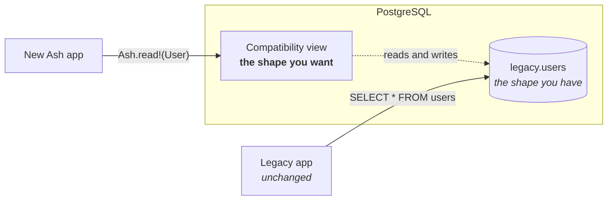
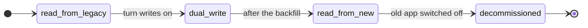
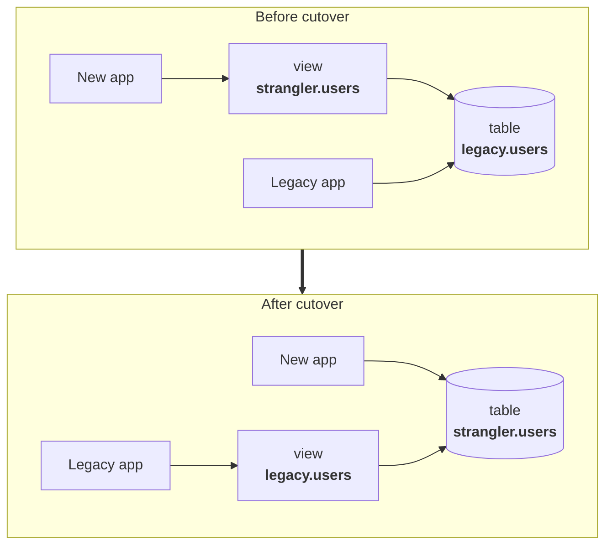

<!--
SPDX-FileCopyrightText: 2026 Luke Galea

SPDX-License-Identifier: MIT
-->

# AshStrangler

**Run your legacy app and your new Ash app against the same PostgreSQL database at the same time — each seeing the schema shape it expects.**

[](https://github.com/lukegalea/ash_strangler/actions/workflows/elixir.yml)
[](LICENSE)
[](#documentation)

---

## The situation

Your application has been running for years, and fifteen years of schema decisions
are baked into its database: `deleted_at` for soft deletes, a `state` column
holding `'active'`, names split across `first_name` and `last_name`, integer
primary keys.

You want to build the replacement in Ash with the model you would choose today —
`archived_at`, a lifecycle enum, `full_name`, UUIDs.

You cannot stop the world to get there. The old application has to keep working
for the eighteen months it takes, and you need to back out at any point, because
somebody is on call throughout.



Neither application knows the other exists.

---

## The idea in thirty seconds

**The strangler fig.** A strangler fig seeds in the canopy of a host tree and
grows down around it, until eventually the fig is self-supporting and the host can
be removed. Applied to software, it means growing the replacement *around* the
original rather than rewriting it in one jump. This library applies it to a
database schema.

**Views can be written to.** This is the part most people have not run into. A
PostgreSQL view is usually described as "a saved query", which makes it sound
read-only. It is not:

- A **simple view** — one table, no aggregates — is *automatically updatable*.
  `UPDATE users SET email = …` against the view just works. Free.
- A **view that reshapes data** — renaming columns, turning `'active'` into `0`,
  joining `first_name` and `last_name` — becomes writable with an `INSTEAD OF`
  trigger: a function saying "when someone writes this view, here is what to do to
  the real table."

Put those together and a view is a **two-way adapter** between the schema you have
and the schema you want.

**You move across in phases**, and you decide when each one happens:



Each step is a one-word edit and a generated migration, and every one but the last
is reversible.

---

## Show me

```elixir
defmodule MyApp.Accounts.User do
  use Ash.Resource,
    domain: MyApp.Accounts,
    data_layer: AshPostgres.DataLayer,
    extensions: [AshStrangler.Resource]

  postgres do
    table "users"          # the VIEW this creates
    schema "strangler"
    repo MyApp.Repo
    migrate? false         # Ash owns the view, not the legacy table
  end

  attributes do
    attribute :id, :uuid, primary_key?: true, allow_nil?: false, writable?: false
    attribute :email, :ci_string, allow_nil?: false, public?: true
    attribute :archived_at, :utc_datetime_usec, public?: true
  end

  strangler do
    phase :read_from_legacy

    source "legacy.users" do
      # Legacy has integer ids, you want UUIDs. Derived deterministically,
      # so there is no lookup table and no join.
      key :id, from: "id", strategy: {:uuid_v5, namespace: "6b1e8b2c-6f6d-4a4a-9f1a-5b0e0d3c4a71"}

      map :email, "email", cast: :citext
      map :archived_at, "deleted_at", cast: :timestamptz, from_zone: "UTC"
    end
  end
end
```

```bash
mix ash_strangler.check          # does the legacy DATA satisfy your new model?
mix ash_strangler.gen.migration  # generate the compatibility layer
mix ecto.migrate
```

You now have a working `MyApp.Accounts.User` — reads, filters, relationships,
policies, the lot — backed by a table you did not design and cannot yet change.

<details>
<summary><b>The SQL it generated</b></summary>

```sql
CREATE OR REPLACE VIEW "strangler"."users" AS
SELECT
  uuid_generate_v5('6b1e8b2c-…'::uuid, 'legacy.users:' || id::text)  AS id,
  id                                                                 AS __legacy_id,
  (email)::citext                                                    AS email,
  (deleted_at AT TIME ZONE 'UTC')                                    AS archived_at
FROM legacy.users;

-- Without this, every Ash.get/2 is a sequential scan.
CREATE INDEX IF NOT EXISTS strangler_users_key_idx ON legacy.users
  (uuid_generate_v5('6b1e8b2c-…'::uuid, 'legacy.users:' || id::text));
```

</details>

---

## Why it is safe to point this at a schema you do not control

You could write these forty lines of SQL yourself. The reason to use a library is
that several of them are wrong in ways PostgreSQL will not tell you about. Each of
these is ruled out at compile time, before any SQL reaches a database:

- **It never silently drops a column.** Every attribute must be mapped, constant,
  or explicitly declared unmapped *with a reason* — because a column nobody
  mentioned reads as `NULL` forever, and nothing raises.
- **It never claims a computed field is writable.** If PostgreSQL cannot invert
  the expression, neither can this library, and it says so while you are compiling
  rather than at 2am. Your stated reason is quoted back in the runtime error.
- **It never lets an identity lie to Ash.** An `identity` on a view is enforced by
  nothing; Ash would plan upserts against a uniqueness constraint the database
  does not have. It must resolve to a real index or the build fails.
- **It never generates a non-deterministic timestamp.** Casting a naive column
  reads it in the *connection's* time zone — the same row is `12:00Z` on one
  connection and `01:30Z` on another. You name the zone or it will not compile.
- **It never quietly costs you upserts.** Adding an `INSTEAD OF` trigger disables
  `ON CONFLICT` — `DO NOTHING` is accepted and then does nothing at all. So
  triggers are generated *only* where the mapping requires them, and a simple
  projection keeps its upserts.

> [!WARNING]
> `ash_authentication`'s `oauth2` and `oidc` strategies **cannot** be defined
> without an upsert, so they are mutually exclusive with the trigger path. The
> `password` strategy is fine — the common case for a legacy monolith. See
> [what it refuses to generate](documentation/topics/what-it-refuses.md).

---

## The phases in full

| | `:read_from_legacy` | `:dual_write` | `:read_from_new` | `:decommissioned` |
|---|---|---|---|---|
| **Source of truth** | legacy tables | legacy tables | the new table | the new table |
| **New app** | reads | reads and writes | owns the data | owns the data |
| **Old app** | unchanged | unchanged | **still unchanged** | switched off |
| **Rollback** | drop the view | drop the triggers | reverse the views | one-way |

At `:read_from_new` the view **flips** — and the name flips with it:



The old application still runs `SELECT * FROM users` and has no idea `users`
stopped being a table. **Cutover is a migration, not a coordinated deploy of two
systems** — which is the most valuable thing here.

→ [The phase model in full](documentation/topics/phases.md)

---

## The rest of the toolkit

| | |
|---|---|
| **`mix ash_strangler.check`** | Runs your new model's assertions against the *legacy data* before you generate anything. NULLs where you declared `allow_nil? false`? Duplicates under your new identity? Values that will not cast? |
| **Backfill** | Batched and resumable, built not to take the database down: keyset pagination, one transaction per batch, and a flag column rather than a predicate that cannot terminate. |
| **Reconciler** | Counts and per-batch checksums across both shapes, with per-column normalization — because Ash's own types transform values on write, and without that the first run is a wall of false positives. |
| **Notifications** | Legacy writes become real `Ash.Notifier.Notification`s, re-read through Ash so calculations, policies and tenancy apply. Your LiveViews update when the *old* app writes. |

---

## Installation

```elixir
def deps do
  [{:ash_strangler, "~> 0.1"}]
end
```

Then add `:ash_strangler` to `import_deps` in `.formatter.exs`, or let the
installer do it:

```bash
mix igniter.install ash_strangler
```

Requires PostgreSQL 14+ and `ash_postgres`.

---

## Documentation

- [How it works](documentation/topics/how-it-works.md) — the mechanism from first principles
- [The phase model](documentation/topics/phases.md) — what each phase generates, and how to move
- [What it refuses to generate](documentation/topics/what-it-refuses.md) — every check and the failure it prevents
- [Backfill and reconciliation](documentation/topics/backfill-and-reconciliation.md)
- [Notifications](documentation/topics/notifications.md)
- [DSL reference](documentation/dsls/DSL-AshStrangler.Resource.md)
- [`usage-rules.md`](usage-rules.md) — rules for AI coding agents editing a mapping

## Status

**Alpha (0.1).** All four phases generate SQL that is executed and tested against a
real PostgreSQL server, including a full migrate → rollback → migrate cycle. The
DSL will still change — pin an exact version. See [CHANGELOG.md](CHANGELOG.md).

> [!NOTE]
> If your new schema lives in a **different database**, this is the wrong tool —
> that is change data capture, and [Debezium](https://debezium.io/),
> [walex](https://github.com/agoodway/walex) or
> [ash_replicant](https://hex.pm/packages/ash_replicant) are what you want. Every
> guarantee here rests on there being one database, and therefore one transaction.

## Contributing

Issues and pull requests welcome. The suite runs against a real PostgreSQL: `mix
test` with a server on `localhost:5432`, or set `DB_HOST` and `PGPORT`.

## License

MIT.
