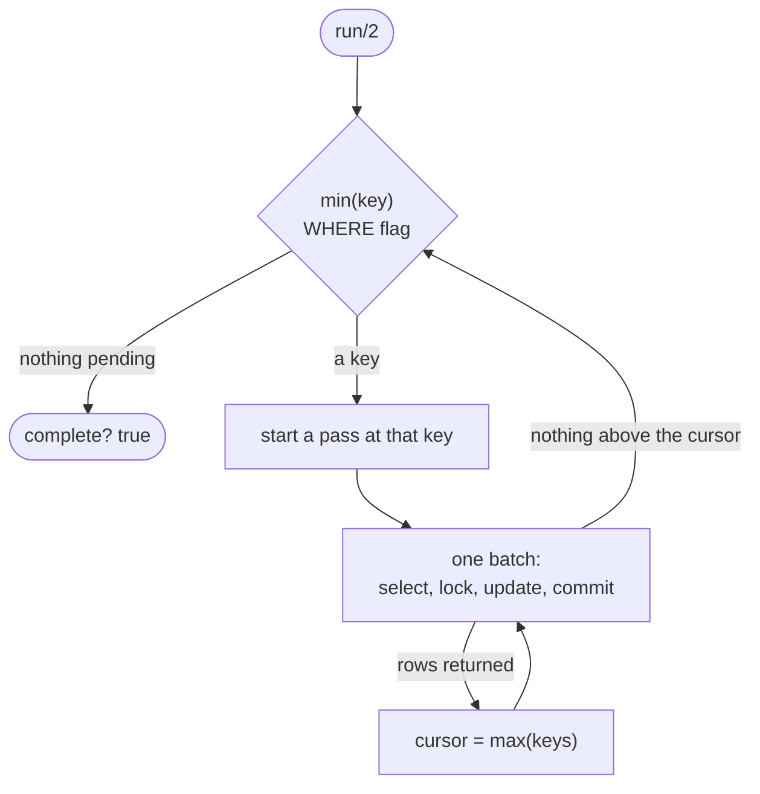

<!--
SPDX-FileCopyrightText: 2026 Luke Galea

SPDX-License-Identifier: MIT
-->

# Backfill and reconciliation

Two operations run during `:dual_write`, and between them they decide whether you
are allowed to cut over. The **backfill** populates data that did not exist
before — a derived key materialised into a real column, a tenant id, a column the
legacy schema never had. The **reconciler** answers the question the phase model
cannot: are the two shapes actually holding the same rows?

Neither is a phase. Both are things you run, repeatedly, while both applications
keep serving traffic.

## Both are derived from the mapping, and both keep the hand-passed form

`AshStrangler.Backfill.plan/2` and `AshStrangler.Reconciler.plan/2` read the
resource and produce the arguments the loop takes. Both are pure — they read the
DSL and touch no database — so **what is about to be written, and what is about to
be compared, is a value you can print and read before anything runs.**

That is not a convenience. Retyping those arguments has one specific failure mode
each, and both are quiet.

For the backfill: the value stored under `store_key:` is *the same uuid expression
the compatibility view projects and the expression index carries*. Three copies of
that expression have to be byte-identical, and when they are not, the view has
been serving derived ids to the new application for weeks, the backfill stores
different ones, and the disagreement only surfaces at `:read_from_new` when the
old application's integer ids stop resolving.

For the reconciler it is worse, because the failure is in the checker itself: **a
column the `columns:` list omits is not compared, and a comparison that skips a
column reports agreement.** The detector's blind spots were a function of how
carefully somebody copied a mapping into a keyword list, nothing ever reported the
omission, and the report came back `agrees?: true` either way.

The hand-passed forms stay, and the reason is unchanged. The operator who needs a
backfill or a drift check most is working on a table the model does not describe
yet — a column added by hand during an incident, a half-migrated tenant, a pair of
relations no resource has ever named. A tool that could only run against a
compiled resource would make *that* the case needing a deploy. The derived path is
a caller of the hand-passed one, not a replacement for it.

---

# The backfill

```elixir
AshStrangler.Backfill.add_flag_column!(MyApp.Repo, "legacy.users")

{:ok, result} =
  AshStrangler.Backfill.run(
    MyApp.Repo,
    AshStrangler.Backfill.plan(MyApp.Accounts.User,
      store_key: :row_uuid,
      batch_size: 5_000,
      progress: fn done, total -> IO.puts("#{done}/#{total}") end
    )
  )

AshStrangler.Backfill.drop_flag_column!(MyApp.Repo, "legacy.users")
```

That is the whole API. What follows is why each mechanism is the one it is,
because every alternative here fails silently rather than loudly.

## What `plan/2` derives, and what it deliberately does not

```elixir
AshStrangler.Backfill.plan(AshStrangler.Test.LegacyUser, store_key: :row_uuid)
#=> [
#     relation: "legacy.users",
#     key: "id",
#     set: [
#       {"row_uuid",
#        "uuid_generate_v5('6b1e8b2c-6f6d-4a4a-9f1a-5b0e0d3c4a71'::uuid, 'legacy.users:' || id::text)"}
#     ]
#   ]
```

- **`relation`** comes off the twin's own `postgres do table/schema end`. A second
  spelling of a table name in a backfill call is a second thing to keep in step.
- **`key`** is the real column behind the `key` entity's `from:`, read through
  `AshStrangler.Twin.column!/2` — so a twin whose generator found a column Elixir
  would not want as an atom still paginates on the real name, and a **stale twin
  raises here** rather than paginating on a column that does not exist.
- **`set`** is one entry per value the mapping says a legacy column should hold and
  the legacy table does not hold yet. `store_key:` materialises the derived primary
  key using `AshStrangler.Sql.View`'s *own* key expression — which is the point:
  the view's `SELECT`, the expression index and this `UPDATE` have to produce
  byte-identical uuids, and a hand-typed fourth copy is a disagreement nothing
  reports.

Every `constant` whose attribute names a column the **twin declares** is also
included. Most constants write nowhere — a constant usually means "no legacy
source for this value", so it lives in the view's `SELECT` list and in no column
at all — and those are correctly absent. One that *does* name a twin column is the
transitional state of an expand step: the column has been added, the twin
regenerated, and the value has yet to be put in it. Once the backfill is done that
`constant` becomes a `map` and the entry disappears from the plan on its own.

`store_key:` is refused for `strategy: :identity`, and the refusal is worth
reading rather than working around: `:identity` means the legacy table already
holds the modern key and `key from:` names the stored column, so there is no
expression to derive a value *from*. Populating it is a choice about what those
uuids should be, which no mapping states — pass `set: [row_uuid:
"gen_random_uuid()"]` and mean it.

An entry in `:set` for a column the derivation also produced **replaces** it,
first-wins, so an operator can correct one column without abandoning the rest of
the plan. Two assignments to one column is a hard error from PostgreSQL, so that
is not a preference.

## The flag column, and why not `WHERE new_col IS NULL`

`add_flag_column!/3` adds one column:

```sql
ALTER TABLE "legacy"."users"
  ADD COLUMN IF NOT EXISTS "_strangler_needs_backfill" boolean NOT NULL DEFAULT true
```

The obvious alternative is to skip the column and batch on the work itself —
`WHERE tenant_id IS NULL`. That predicate is wrong the moment the *correct* value
of the target column can legitimately be null, and `unmapped [...], as: :null`
guarantees that case exists in a strangler mapping. When the backfill's job is to
write `NULL`, a finished row becomes indistinguishable from a pending one: the
batch re-selects it forever and the loop never terminates. **The failure is a hung
job, not an error** — every pass does real work, updates real rows and reports real
progress, so nothing in the counters ever looks wrong.

The approach is taken from `pgroll`'s implementation, which adds
`_pgroll_needs_backfill boolean DEFAULT true` and batches on it for the same
reason.

Three details of that `ALTER TABLE` are load-bearing:

- **`DEFAULT true` is a constant**, so on PostgreSQL 11 and later this is a
  catalog-only change: no table rewrite, and the `ACCESS EXCLUSIVE` lock is held
  for microseconds rather than for the length of a full rewrite. A *volatile*
  default — `gen_random_uuid()`, or a stored generated column — does rewrite,
  which is why the expand step adds nullable columns and backfills them instead of
  adding a defaulted `uuid` column.
- **`NOT NULL DEFAULT true` means rows the legacy application inserts *after* this
  runs arrive flagged**, and so get backfilled. The flag is cleared by a row having
  been processed, not by it having existed when the backfill started.
- **`IF NOT EXISTS`, never `DROP` then `ADD`.** The `DROP`/`ADD` pairing is the
  obvious way to make setup idempotent, and it silently restarts a
  forty-million-row backfill from zero.

Contract the column only once nothing still writes to it. A trigger that assigns
to a dropped column fails every write on the legacy table.

## One batch, one transaction, keyset paginated

Each batch is a single statement inside its own committed transaction. This is
what the loop actually issues, for the plan above:

```sql
WITH strangler_batch AS (
  SELECT "id" AS strangler_key
  FROM "legacy"."users"
  WHERE "_strangler_needs_backfill" AND "id" >= $1
  ORDER BY "id"
  LIMIT 1000
  FOR NO KEY UPDATE
)
UPDATE "legacy"."users" AS strangler_target
SET "row_uuid" = uuid_generate_v5('6b1e8b2c-6f6d-4a4a-9f1a-5b0e0d3c4a71'::uuid, 'legacy.users:' || id::text), "_strangler_needs_backfill" = false
FROM strangler_batch
WHERE strangler_target."id" = strangler_batch.strangler_key
RETURNING strangler_target."id"
```

`>=` on the first batch of a pass, because the cursor is itself a pending key;
`>` from then on. Keeping the cursor semantics in the comparison operator rather
than in a "have I started yet" flag is what lets one template serve both.

**Keyset pagination, never `OFFSET`.** `OFFSET n` re-walks and discards `n` rows on
every batch, so the cost of a backfill is quadratic in table size and its last
batches are its slowest. Worse, `OFFSET` is only stable if the ordering is stable,
and a backfill mutates the very rows it is ordering over.

**One committed transaction per batch.** The tempting single large `UPDATE` holds
every row lock for the whole run, pins the global xmin so `VACUUM` reclaims
nothing *cluster-wide* for the duration, and cannot be resumed: kill it at 90% and
90% is lost.

**`FOR NO KEY UPDATE`, not `FOR UPDATE`.** Both lock the batch's rows against
concurrent update; only `FOR UPDATE` additionally blocks a concurrent foreign-key
check referencing them. A backfill is not changing the key, so it has no reason to
make every FK check on a busy child table queue behind it.

There is no `lock_timeout` on the batches, unlike on the DDL. These are row locks
behind ordinary application writes, and aborting a batch because one row was
briefly locked would turn a busy table into a backfill that never finishes.

The new cursor is `max` of the returned keys, not `List.last/1`: `RETURNING` makes
no ordering promise, and a cursor that is not the true maximum silently re-reads
rows that are already done — or, if it is too high, skips rows forever.

## Passes: why a cursor alone is not enough

The cursor lives in memory for the duration of a run and is deliberately not
persisted anywhere. It does not need to be, because **the flag column *is* the
persisted state.** An interrupted run resumes by being called again, from a
different machine if necessary, with no coordination and no cursor file to go
stale.

That also fixes a hazard a persisted cursor cannot. `bigserial` values are handed
out in order but *committed* out of order, so a row can appear with a key *below*
a cursor that has already gone past it. This is ordinary on a live table, not
exotic. So the loop is two levels deep:



Each pass sweeps upward from `min(key) WHERE flag` rather than from "the
beginning" — on a table that is 39/40ths done, starting at the beginning means
walking 39 million index entries to find the first row that matters, every time
the job restarts:

```sql
SELECT min("id") FROM "legacy"."users" WHERE "_strangler_needs_backfill"
```

When a pass exhausts, the minimum pending key is recomputed and another pass
sweeps; only when nothing is pending does the run stop.

`result.passes` greater than one is therefore normal on a live table, and is
information rather than a warning.

## The two anti-spin guards

Both of these detect situations that would otherwise loop forever while looking
exactly like a slow job.

**A pass that starts where an earlier pass started raises.** Clearing the flag is
durable, so the only ways a completed key becomes pending again are something
re-setting the flag — a trigger on the legacy table that fires on the backfill's
own `UPDATE` is the realistic one — or the key being deleted and reinserted.
Nothing in the counters would ever look wrong: every pass does real work and
reports real progress, and the job simply never finishes.

**Three consecutive passes that update nothing raise**, if `min(key) WHERE flag`
is still returning a row. That combination means something outside the process is
holding rows in a state the loop cannot act on. Continuing would spin, so it
stops.

## The interlock is half-built, and the missing half is not in this module

`pgroll` has a second mechanism alongside the flag column, and only the column was
taken: **its writer clears the flag.** The dual-write trigger sets
`_pgroll_needs_backfill = false` on every row it writes, so a row the trigger has
already handled is never re-derived by the backfill.

Without that half the sequence is: the compatibility view's `INSTEAD OF` trigger
writes a row correctly, leaves the flag `true` because nothing told it to clear
it, and a later batch re-derives that row's columns from the legacy row and
overwrites what the trigger stored.

Being precise about the size of the gap matters more than adding SQL that looks
like a fix. The batch statement already selects `WHERE flag` under
`FOR NO KEY UPDATE`, and PostgreSQL re-evaluates a locking query's qualification
against the updated row version — so every row a concurrent writer *did* clear is
already dropped from the batch. The gap is entirely the `false` the writer never
assigns. `AshStrangler.Backfill.interlock_assignment/1` is that assignment,
exported so the writer and the batch statement cannot spell the column
differently:

```elixir
AshStrangler.Backfill.interlock_assignment()
#=> ~s("_strangler_needs_backfill" = false)
```

**What the gap costs depends on the `set` expressions, and this is the one place
the derived plan is strictly safer than a hand-written one.** `plan/2` derives
only **row-functional** values — a key expression over the row's own key, a
constant — so re-deriving a row the trigger already handled produces identical
bytes and there is nothing to lose. A hand-passed `set: [counter: "counter + 1"]`
is not row-functional, and the same race double-applies it: the stored value is
wrong, every count of rows and batches reads correctly, and nothing reports it.

## Fitting a backfill into a maintenance window

`:max_batches` stops the run after that many committed batches and reports
`complete?: false`. Resuming is calling `run/2` again — there is nothing else to
do, because the flag column carries the state.

```elixir
{:ok, %{complete?: false, rows: rows}} =
  AshStrangler.Backfill.run(
    MyApp.Repo,
    AshStrangler.Backfill.plan(MyApp.Accounts.User, store_key: :row_uuid, max_batches: 200)
  )
```

`run/2` takes `:relation` and `:key` (required), plus `:set`, `:batch_size`
(default `1_000`), `:flag_column`, `:progress`, `:max_batches` and `:total`.
`plan/2` supplies the first three and passes the rest through. It returns
`{:ok, result}` where `result` is:

| Field | Meaning |
|---|---|
| `:rows` | rows actually updated — not an estimate |
| `:batches` | committed batch transactions |
| `:passes` | sweeps from `min(key) WHERE flag` |
| `:total` | the row-count estimate reported to `:progress`, for reference |
| `:complete?` | false only when `:max_batches` stopped the run early |

`:total` comes from `pg_stat_user_tables.n_live_tup`, which is free, falling back
to an exact `count(*)` when the estimate is `0` — which is exactly the state a
freshly loaded table is in before autovacuum has visited it, and a progress bar
reading `1000/0` is worse than no progress bar.

`AshStrangler.Backfill.pending_count/3` gives an exact `count(*)` of flagged rows.
It is a diagnostic, not something to call in a loop.

## `:set` values are SQL, on purpose

Values in `:set` are interpolated verbatim, not bound. This is a SQL generator,
and the point is to push the work into the database rather than pull forty million
rows through the BEAM. They are evaluated against the row being updated, so
`[counter: "counter + 1"]` is legal and means what it says.

Column names are validated as plain SQL identifiers; values are not touched at
all. That asymmetry is the contract — there is no bind-parameter form for a column
name, so validation is the only defence available on the left-hand side, and the
right-hand side is an expression by design. It is also why the derived plan is the
form to prefer whenever there is a mapping to derive it from: every expression it
produces comes from `AshStrangler.Sql.Printer`, which owns literal escaping in one
function.

## DDL under a lock timeout

`AshStrangler.Backfill.with_lock_retry/3` is public because every DDL statement a
strangler migration issues wants this treatment, not just the two in this module:

```elixir
AshStrangler.Backfill.with_lock_retry(MyApp.Repo, [lock_timeout: 3_000], fn ->
  MyApp.Repo.query!("ALTER TABLE legacy.users ADD COLUMN IF NOT EXISTS row_uuid uuid", [])
end)
```

A DDL statement waiting for `ACCESS EXCLUSIVE` goes to the **head** of the lock
queue, and every subsequent `SELECT` queues behind it. One long-running reader plus
one waiting `ALTER TABLE` takes the table offline for everyone — the `ALTER` has
not run, and the reads are not running either. A short `lock_timeout` converts that
outage into a retry, on SQLSTATE `55P03` only. Retrying anything else — a syntax
error, a missing column — burns the whole backoff budget to arrive at the same
failure and hides the real one behind a delay. `statement_timeout` is not a
substitute either: it also kills a DDL that has already acquired its lock and is
doing legitimate work, which is the one case you want to leave alone.

Each attempt is its own transaction. A failed statement poisons its transaction —
everything after it errors with `25P02 current transaction is aborted` — so
retrying inside the transaction that just took the `55P03` cannot succeed. It
fails with a different, more confusing error, and does so instantly, so the
backoff appears to work while never actually retrying anything.

## What the backfill does not do

It issues no `CREATE INDEX CONCURRENTLY`. A partial index on `(key) WHERE flag` is
the right way to keep resumption cheap on a large table, but CIC cannot run in a
transaction block, and on failure it leaves an *invalid* index behind that still
costs write throughput — so it needs a `pg_index.indisvalid` check and a migration
of its own. That belongs with a migration, not in a loop that is expected to be
safe to kill at any moment.

---

# The reconciler

Drift detection between two relations that are supposed to hold the same rows: a
legacy table and the compatibility view over it, or the legacy table and the new
table during dual-write.

```elixir
%{agrees?: true} = AshStrangler.Reconciler.diff(MyApp.Accounts.User)
```

`diff/2` runs counts first, then per-batch checksums, and returns structured data.
It logs nothing and decides nothing.

It accepts either subject. An Ash resource and an `Ecto.Repo` are
distinguishable — `Ash.Resource.Info.resource?/1` is a definite answer rather than
a guess — so one name serves both without a mode flag.

## Both halves of the comparison come out of one declaration

```elixir
AshStrangler.Reconciler.plan(AshStrangler.Test.LegacyUser)
#=> [
#     repo: AshStrangler.TestRepo,
#     legacy: [relation: "legacy.users", key: "id"],
#     view: [relation: "strangler.users", key: "__legacy_id"],
#     columns: [
#       login: {"login", "login"},
#       email: {"(email)::citext", "email"},
#       full_name: {"(coalesce(first_name, '') || (' ' || coalesce(last_name, '')))", "full_name"},
#       archived_at: {"(deleted_at AT TIME ZONE 'UTC')", "archived_at"}
#     ],
#     normalize: %{email: :ci_string, full_name: :trim, login: :trim}
#   ]
```

Read the left half of each pair against the view's own `SELECT` list in
[the phase model](phases.md#read_from_legacy): they are the same strings, because
they come from the same lens forward expression through the same printer. The
right half is the attribute name. So a mapping and the check on that mapping
cannot disagree about what the mapping says.

`repo:` is the resource's **`:read`** repo, not `:mutate`. A drift check writes
nothing, and on a project with a read replica it has no business occupying the
primary. Replication lag does not corrupt the answer, because both sides are read
inside one statement and therefore one snapshot.

Every value in `opts` **replaces** the derived one wholesale rather than merging
into it, `normalize: %{}` included. An override is a statement that the derivation
is wrong for this run, and a half-applied override would be a third thing that is
neither.

### Which columns are compared

Every attribute that has a mapping lens, in resource declaration order, minus
three kinds that carry no information: the **key**, whose two sides are the
comparison's own join condition; `constant`, whose value the view manufactures, so
both sides would render the same literal and agree by construction; and
`unmapped`, which is a declaration that there is nothing on the legacy side to
compare against.

A `read_only?` mapping **is** compared. Being unable to write a value back has
nothing to do with whether the value the view serves is right, and this is the
column most likely to be wrong: `full_name` is exactly the shape of mapping that
gets its null-defaulting wrong and reports `"NULL Cruz"` to every consumer.

### Joins

The legacy side is `AshStrangler.Sql.View.from_clause/1` — the view's own `FROM`,
joins and all — rather than the bare relation, and the column expressions are
printed in the view's own reference frame. A mapping that reads
`expr(address.city)` therefore reconciles against the same rows the view projects.
Assembling a bare `FROM legacy.users` instead would fail on the first qualified
reference, which is the good outcome; deriving an unqualified frame to make it
parse would compare a different query, which is not.

## The hand-passed form

```elixir
config = [
  legacy: [relation: "legacy.users", key: "id"],
  view: [relation: "strangler.users", key: "__legacy_id"],
  columns: [
    email: "email",
    full_name: {"coalesce(first_name,'') || ' ' || coalesce(last_name,'')", "full_name"}
  ],
  normalize: %{email: :ci_string}
]

%{agrees?: true} = AshStrangler.Reconciler.diff(MyApp.Repo, config)
```

Each entry in `:columns` is `name: "expression"` when both sides spell it the same
and `name: {legacy_expression, view_expression}` when they do not. Both halves are
SQL *expressions*, not identifiers, because the usual reason a column needs
reconciling is that it is a projection on one side and a single column on the
other.

`diff(resource, opts)` is `plan/2` followed by this function and nothing else.

## The same function is the scheduled job and the test assertion

The Oban job that runs nightly and the test that asserts a mapping is faithful call
the identical function and read the identical map. That is not tidiness: the drift
check *is* the correctness oracle for this package, so if the production checker
and the test checker were different code, the tests would certify something nobody
is running.

Which raises the obvious question — who checks the checker? Every mutation the
reconciler can detect is proven in `test/ash_strangler/reconciler_test.exs` by
deliberately introducing that mutation and asserting it is found. A drift detector
nobody has proven can detect drift is worse than no drift detector, because it
manufactures confidence.

## Counts

```elixir
AshStrangler.Reconciler.count_drift(MyApp.Accounts.User)
#=> %{agrees?: false, legacy: 40_112_004, view: 40_111_998, drift: 6}
```

Cheap, and the first thing worth knowing. `drift` is `legacy - view`, signed, so
the direction is legible without comparing the other two numbers. Both counts come
from a single statement, for the reason two sections down:

```sql
SELECT
  (SELECT count(*) FROM legacy.users),
  (SELECT count(*) FROM strangler.users)
```

## Checksums

```elixir
%{agrees?: false, mismatched: [batch | _], columns: columns} =
  AshStrangler.Reconciler.checksum_drift(MyApp.Accounts.User)

batch
#=> %{agrees?: false, lower: 8001, upper: 9000, rows: 1000,
#     legacy: "3f1c…", view: "9ab4…"}
```

The key space is walked in `:batch_size` ranges (default `1_000`) and each side of
each range is md5'd. The answer to "where is the drift" is therefore a key range a
human can go and look at, rather than "somewhere in forty million rows".
`:mismatched` is the sublist of `:batches` that disagreed — the thing to open.

Checksums run even when the counts agree, because equal counts with unequal values
is the interesting failure: a mapping that reads the wrong column keeps the row
count perfect.

Four decisions inside that pass are worth knowing about, because the obvious
implementation gets each of them wrong.

**Batch bounds come from the `UNION` of both sides' keys.** Batching off the legacy
side alone is the obvious implementation and it is unsound: a key that exists only
in the view falls outside every range, so the pass reports agreement for a row it
never looked at. The union costs one more index scan and closes the hole:

```sql
WITH strangler_keys AS (
  SELECT id AS k FROM legacy.users
  WHERE id >= $1
  UNION
  SELECT __legacy_id AS k FROM strangler.users
  WHERE __legacy_id >= $1
)
SELECT min(k), max(k), count(*)
FROM (SELECT k FROM strangler_keys ORDER BY k LIMIT 1000) strangler_page
```

`rows` on each batch is that `count(*)` — distinct keys across *both* sides — so a
row present on only one of them still counts.

**Both checksums are computed in one statement.** Under `READ COMMITTED` each
statement takes a fresh snapshot, so two separate `SELECT`s see two different
states of the database and any concurrent write between them looks exactly like
drift. A nightly job on a live table would report drift more or less at random.
Both sides are therefore scalar subqueries of a single statement, sharing the batch
bounds as bind parameters — the two sides must be given literally the same range,
not two renderings of it. This is the statement, for the derived plan above:

```sql
SELECT
  (SELECT coalesce(
         md5(string_agg(concat_ws('|', quote_nullable((btrim((login)))::text), quote_nullable((lower(btrim(((email)::citext))))::text), quote_nullable((btrim(((coalesce(first_name, '') || (' ' || coalesce(last_name, ''))))))::text), quote_nullable(((deleted_at AT TIME ZONE 'UTC'))::text)), E'\n' ORDER BY id)),
         ''
       )
FROM legacy.users
WHERE id BETWEEN $1 AND $2
),
  (SELECT coalesce(
         md5(string_agg(concat_ws('|', quote_nullable((btrim((login)))::text), quote_nullable((lower(btrim((email))))::text), quote_nullable((btrim((full_name)))::text), quote_nullable((archived_at)::text)), E'\n' ORDER BY __legacy_id)),
         ''
       )
FROM strangler.users
WHERE __legacy_id BETWEEN $1 AND $2
)
```

Every column expression in the legacy half is the view's own projection, and every
normalizer is applied to both halves. Nothing in that statement was typed.

**The per-row encoding has to be injective, and the obvious one is not.**
`concat_ws('|', a, b)` *skips* nulls rather than encoding them, so it moves a
column boundary: `(NULL, 'a|b')` and `('a', 'b')` both render as `a|b`, and a row
that lost a value to NULL is reported as agreeing with one that did not. Checked
on 17.10, `concat_ws` *does* distinguish `NULL` from `''` when neither is at a
boundary — which makes this the more dangerous kind of bug, because it is right in
the case you would test by hand. Every value is therefore wrapped in
`quote_nullable`, which renders `NULL` as the bare word `NULL` and everything else
as a quoted, escaped literal, so nothing in a value can imitate a separator and
nothing can be omitted.

**`ORDER BY` goes inside `string_agg`, not outside.** Without it the aggregation
order is whatever the scan produced, so an `UPDATE` that moved one row to the end
of the heap on one side changes that side's checksum and nothing else. The drift
would be real-looking, reproducible, and entirely fictional.

## Normalization, and why it is derived

Ash normalises values on the way in. `Ash.Type.CiString` defaults to
`trim?: true`, so `" alice@example.com"` written *through Ash* is stored trimmed,
while the identical value written by the legacy application is stored as given.
The same applies to any Ash type with normalising constraints.

**Both are correct.** Each side stores what it is supposed to store. This is not a
defect the mapping can fix, and it should not try — the entire reason to adopt Ash
is that it validates and normalises. But it means "the two write paths agree" is
false by construction for some columns.

A comparison that does not know this reports every such row as drift, forever. And
a drift report that is mostly false positives gets muted, which is how a team ends
up with a drift detector and no drift detection. That is the failure the
normalization hook exists to prevent, and it is a human failure rather than a
technical one, which is why it is worth being explicit about.

The attribute's own type already says which normalisation Ash performed, so that
is where the normalizer comes from:

| Attribute type | Derived | Because |
|---|---|---|
| `Ash.Type.CiString` | `:ci_string` — `lower(btrim(…))` | trims by default, and declares case not to be information |
| `Ash.Type.CiString`, `trim?: false` | `:downcase` — `lower(…)` | keeps its whitespace, so trimming it away here would hide drift that is real |
| `Ash.Type.String`, `trim?: true` | `:trim` — `btrim(…)` | Ash discards surrounding whitespace on write |
| anything else | none | |

That table is most of the argument for deriving it rather than passing it. Nobody
hand-writes `:trim` against every string column of a wide resource, and every
string column they miss is a permanent false positive on a report whose only
defence against being ignored is that it is usually empty. `trim?` defaults to
true on both string types, so an attribute that says nothing about trimming is
still trimming — and a derivation that read a missing constraint as "no
normalisation" would restore exactly the false positives it exists to remove.

Three properties of the hook are load-bearing:

- **It is SQL, not Elixir.** The entire value of a checksum is that the comparison
  happens in the database over whole batches. A normalizer that forced rows into
  the BEAM would defeat the mechanism it is part of.
- **It is applied to *both* sides.** Applying it only to the legacy side would
  assume Ash's normalisation is idempotent — usually true, never guaranteed.
  Applied to both, the comparison stops being "are these bytes equal" and becomes
  "are these values equal *modulo the transformation Ash performs*", which is the
  question actually being asked.
- **The shorthands are named after the cause, not the effect.** `:ci_string`
  records *why* the column needs normalising — because the Ash attribute is an
  `Ash.Type.CiString` — where `"lower(btrim(%s))"` would leave the next reader to
  reverse-engineer it.

A hand-passed `normalize:` takes the same three shorthands, plus
`fn expr -> "my_fn(#{expr})" end` for a divergence none of them describes. An
unrecognised value raises rather than being ignored: ignoring it would compare the
column un-normalised and fill the report with exactly the false positives the
entry was written to prevent.

One caution that no code can enforce: a normalizer is a way to ignore a *known,
explained* transformation, not a way to stop looking at a column. A normalizer
that returns a constant would make any column agree with itself forever. Keep them
as narrow as the divergence they describe.

## A time zone is part of the expression, not a normalizer of its own

Comparing a naive `timestamp` against a `timestamptz` compares a rendering
artefact rather than two instants, and there used to be a normalizer for exactly
that — `archived_at: {:sql, "%s AT TIME ZONE 'UTC'"}` — sitting alongside the
view's own `AT TIME ZONE 'UTC'`, with nothing relating the two. Two spellings of
one rule drift, and when *this* pair drifts the reconciler quietly reports drift
that is not there, or agreement that is not there.

`zone:` is part of the forward expression, and the forward expression is what both
sides of the comparison are printed from. Look at the `archived_at` line in the
derived plan above: the zone is stated once, in the mapping, and appears in the
checksum statement because the checksum statement is printed from the mapping.
**There is no `{:sql, template}` normalizer**, and there is nothing left for it to
disagree with.

## Running it

As a test, against a fixture:

```elixir
test "the users mapping is faithful" do
  assert %{agrees?: true} = AshStrangler.Reconciler.diff(MyApp.Accounts.User)
end
```

As a scheduled job, where the output matters more than the boolean:

```elixir
def perform(_job) do
  case AshStrangler.Reconciler.diff(MyApp.Accounts.User) do
    %{agrees?: true} ->
      :ok

    %{counts: counts, checksums: %{mismatched: mismatched}} ->
      Logger.error("""
      strangler drift on MyApp.Accounts.User
        counts: #{inspect(counts)}
        ranges: #{Enum.map_join(mismatched, ", ", &"#{&1.lower}..#{&1.upper}")}
      """)

      {:error, :drift}
  end
end
```

---

## The order these come in

1. Enter `:dual_write` and ship the write path.
2. `add_flag_column!/3`, then `run/2` with a plan derived from the resource, until
   `complete?: true` and `pending_count/3` returns `0`.
3. `diff/2` until `agrees?: true`. Print `plan/2` first if a result is surprising:
   what got compared, on which expression, under which normalizer, is a value you
   can read.
4. Keep the reconciler running on a schedule for as long as both applications
   write. It is the only thing that will tell you a legacy code path you did not
   know about is still writing values your mapping cannot round-trip.
5. Only then move to `:read_from_new`. An incomplete backfill at cutover produces
   missing rows, not an error.
