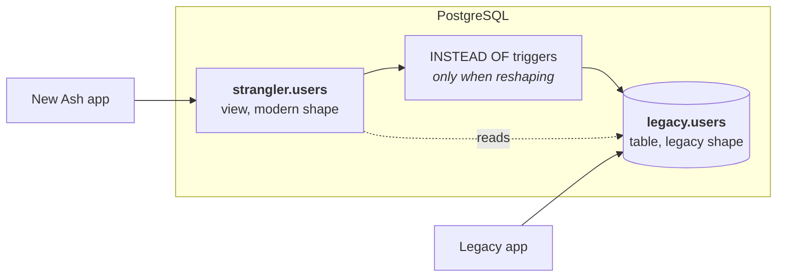

<!--
SPDX-FileCopyrightText: 2026 Luke Galea

SPDX-License-Identifier: MIT
-->

# How it works

This guide explains the mechanism from first principles. You do not need to know
the strangler-fig pattern, and you do not need to have made a PostgreSQL view
writable before.

## The problem, precisely

Two applications need the same rows, and they disagree about what those rows look
like — usually not by a little.

The legacy application expects one `accounts` table holding a person, their
employer and their address together, with the lifecycle spread across
`is_active`, `is_deleted`, `approved_at` and `cancelled_at`. That expectation is
compiled into fifteen years of queries, reports and background jobs, and you are
not allowed to change it today.

The new application wants what you would design now: a `Customer`, an
`Organization` and an `Address` as separate resources with real relationships,
one `status` governed by a state machine, and UUID keys.

Copying the data into second tables means writing synchronisation, and
synchronisation means a window where the two disagree. What you want instead is
**one set of rows, presented two ways** — and the presentation can differ in shape,
not just in column names.

### This is expand/contract

The formal name for the technique is **expand/contract**, or parallel change:
expand the schema so both shapes coexist, move readers and then writers across,
then contract by removing the old. The phases in this library are that sequence,
with the middle step split so reads and writes move independently.

## Views are not read-only

A view is usually introduced as "a saved query" — a name for a `SELECT` you do not
want to retype. That framing is what makes people assume it is read-only, and it
is why this whole approach tends to be overlooked.

PostgreSQL views come in two flavours for writes.

### Automatically updatable views

A view that selects from a *single* table, with no `DISTINCT`, `GROUP BY`,
aggregates, window functions or set operations at the top level, is
**automatically updatable**. You write to the view and PostgreSQL rewrites the
statement to hit the underlying table.

```sql
CREATE VIEW app.users AS
  SELECT id, email, deleted_at FROM legacy.users;

UPDATE app.users SET email = 'new@example.com' WHERE id = 1;
-- Succeeds. No triggers involved.
```

This costs nothing and is surprisingly capable. A view may even contain computed
columns and stay updatable — PostgreSQL simply refuses writes *to those specific
columns*, with a clear error, while the ordinary columns keep working.

### `INSTEAD OF` triggers

When the view genuinely reshapes data — combining two columns into one,
translating `'active'` into `0`, writing into a column the view renamed — automatic
updatability is not enough. For that, PostgreSQL lets you attach an `INSTEAD OF`
trigger:

```sql
CREATE FUNCTION app.users_update() RETURNS trigger AS $$
BEGIN
  UPDATE legacy.users
     SET state = CASE NEW.state_code WHEN 0 THEN 'active' ELSE 'suspended' END
   WHERE id = OLD.__legacy_id;
  RETURN NEW;
END $$ LANGUAGE plpgsql;

CREATE TRIGGER users_update INSTEAD OF UPDATE ON app.users
  FOR EACH ROW EXECUTE FUNCTION app.users_update();
```

Now a write to the view runs *your* code instead of PostgreSQL's default
rewriting. The view has become a two-way adapter.

## Putting it together



The legacy application talks to the table directly and is completely unaffected.
The new application talks to a view that presents the modern shape, and writes
travel back through the triggers.

## What AshStrangler generates

Given a mapping, four kinds of statement come out. Each is a single SQL command,
because Ecto sends a migration's `execute/1` string on PostgreSQL's extended
protocol, which rejects multi-command strings with
`42601 cannot insert multiple commands into a prepared statement`.

### 1. The view

Every attribute on the resource must appear in the `SELECT` list. There is no
"and the rest" — a column the view does not name simply does not exist for the new
application.

```sql
CREATE OR REPLACE VIEW "strangler"."users" AS
SELECT
  uuid_generate_v5('6b1e…'::uuid, 'legacy.users:' || id::text)  AS id,
  id                                                            AS __legacy_id,
  (email)::citext                                               AS email,
  coalesce(first_name,'') || ' ' || coalesce(last_name,'')      AS full_name,
  (deleted_at AT TIME ZONE 'UTC')                               AS archived_at
FROM legacy.users;
```

Two details in there are load-bearing.

**The generated view always enumerates its columns; it never uses `SELECT *`.**
A legacy schema is by definition one whose owners still add columns, and changing a
view's result shape invalidates cached query plans — connections holding a prepared
statement against it get `0A000 cached plan must not change result type`. Postgrex
recovers by re-preparing, *except* on a connection already inside a failed
transaction. An explicit column list means somebody else's `ALTER TABLE ADD COLUMN`
does not become your connection-pool incident.

**`__legacy_id` carries the original key.** The derived UUID is a one-way hash, so
nothing can compute the legacy id back from it. Every write path keys off
`__legacy_id` rather than trying to invert the derivation.

### 2. The key, and why there is no lookup table

Legacy integer keys against modern UUIDs is the first thing everyone hits. The
tempting answer is a mapping table — `legacy_id` to `uuid` — which then becomes a
second source of truth and a join on every single row.

Instead the modern id is *derived* from the legacy one, deterministically, with
UUIDv5:

```
uuid_generate_v5(namespace, 'legacy.users:' || id::text)
```

Because it is deterministic, the same derivation runs in Elixir with no database
round trip at all:

```elixir
AshStrangler.KeyDerivation.uuid_v5(
  namespace,
  AshStrangler.KeyDerivation.name("legacy.users", 1)
)
#=> "5ecf8b7b-8241-5b27-a03c-4411a476359f"
```

Both sides build the hashed name through the same function, so the format cannot
drift, and the test suite asserts the two agree over generated inputs — including
non-ASCII ones, where hashing codepoints instead of UTF-8 bytes would produce a
stable, plausible, permanently wrong answer.

### 3. The expression index

`uuid_generate_v5` is `IMMUTABLE`, which means PostgreSQL can index the expression:

```sql
CREATE INDEX strangler_users_key_idx ON legacy.users
  (uuid_generate_v5('6b1e…'::uuid, 'legacy.users:' || id::text));
```

Without it, every `Ash.get/2` by modern id is a sequential scan — correct, and
catastrophic at production volumes. The index is built from the *same* expression
the view uses rather than a restatement of it, because PostgreSQL will only use an
expression index when it matches exactly, and a difference as small as whitespace
makes it silently decline.

### 4. Joins, when the model gathers rather than splits

A resource can pull in columns the legacy schema scattered:

```elixir
join "legacy.addresses", as: "addr", on: "addr.account_id = accounts.id"
```

which makes the `FROM` clause a join and aliases the primary relation so column
names stay unambiguous:

```sql
FROM legacy.accounts AS accounts
  LEFT JOIN legacy.addresses AS addr ON addr.account_id = accounts.id
```

Three consequences follow, and all three are enforced rather than documented:

**`LEFT` is the default.** An `INNER JOIN` removes rows — a legacy row with no
match simply stops existing for the new application, and the only symptom is a
row count lower than the old application's. That is the same class of silent loss
as an unmapped column, so it is not something to opt into by accident.

**The view stops being auto-updatable.** Auto-updatability requires exactly one
base table, so any join forces the trigger path. `AshStrangler.Info.writes/1`
derives that for you.

**Joined columns are read-only.** Writes reach the primary relation through
`__legacy_id`, which identifies exactly one row there. Nothing identifies the
corresponding row in a joined relation — and under a `LEFT JOIN` there may not be
one — so there is no write to generate that is right for every schema. Model the
joined relation as its own resource and write it there.

There is a fourth consequence that no compile-time check can see: **if the joined
relation has more than one row per primary row, the view returns duplicates for a
single primary key.** `Ash.get/2` finds more than one record, counts inflate, and
the SQL is perfectly valid throughout. It depends entirely on the data, so
`mix ash_strangler.check` measures it — comparing rows through the view against
rows in the primary relation, and reporting both fan-out and rows lost.

### 5. `INSTEAD OF` triggers, only where required

Triggers are **not** generated for every mapping, because adding one is a trade
rather than an addition. Attaching an `INSTEAD OF` trigger to an auto-updatable
view silently removes three things:

| | Auto-updatable view | With an `INSTEAD OF` trigger |
|---|---|---|
| `INSERT … ON CONFLICT DO UPDATE` | works | errors |
| `INSERT … ON CONFLICT DO NOTHING` | works | **accepted, then does nothing** |
| `WITH CHECK OPTION` | enforced | **silently ignored** |
| Governs every write | no — `MERGE` bypasses it | yes |

So a single-table projection of plain columns is left alone and keeps its upserts.
A mapping with a computed writable column (`to:`/`into:`) forces triggers, and
`AshStrangler.Info.writes/1` derives which case you are in.

Where triggers *are* generated, they re-read the stored row before returning it.
That is not defensive style — it is required. See
[What it refuses to generate](what-it-refuses.md) for what the obvious
implementation does instead.

## Where the SQL comes from

Not `mix ash.codegen`. A strangler resource's `table` names a view, and neither
setting of `migrate?` can carry the DDL:

- `migrate? true` makes the migration generator emit a `create table` for the
  view's own name, and the view DDL then fails against it.
- `migrate? false` stops the resource producing a snapshot at all — and
  `custom_statements` are only read from snapshots — so the DDL is silently
  dropped.

`migrate? false` is therefore required (the compiler enforces it) and the DDL is
emitted by `mix ash_strangler.gen.migration`. This is the same position
AshPostgres takes for view-backed resources generally: `mix
ash_postgres.gen.resources --include-views` writes `migrate? false` beside a
comment saying migrations for views are handled manually. This package automates
the manual part.

Every generated statement is idempotent — `CREATE OR REPLACE`,
`CREATE INDEX IF NOT EXISTS` — so the workflow after changing a mapping is to
regenerate and run the new migration, never to hand-edit the old one.

## Next

- [The phase model](phases.md) — how the mapping moves from reading legacy data to owning it
- [What it refuses to generate](what-it-refuses.md) — the compile-time checks, and the specific failure each prevents
