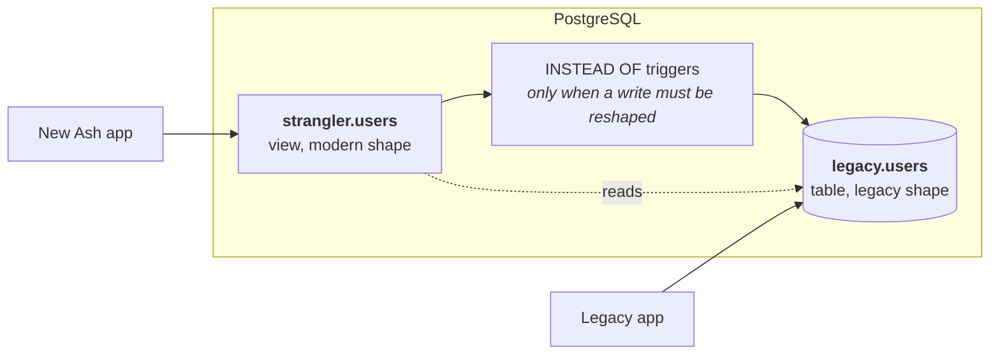

<!--
SPDX-FileCopyrightText: 2026 Luke Galea

SPDX-License-Identifier: MIT
-->

# How it works

This guide explains the mechanism from first principles. You do not need to know
the strangler-fig pattern, you do not need to have made a PostgreSQL view
writable before, and you do not need to have met a lens law.

## The problem, precisely

Two applications need the same rows, and they disagree about what those rows look
like — usually not by a little.

The legacy application expects one `accounts` table holding a person, their
employer and their address together, with the lifecycle spread across
`is_active`, `is_deleted`, `approved_at` and `cancelled_at`. That expectation is
compiled into fifteen years of queries, reports and background jobs, and you are
not allowed to change it today.

The new application wants what you would design now: a `Customer`, an
`Organization` and an `Address` as separate resources with real relationships,
one `status` governed by a state machine, and UUID keys.

Copying the data into second tables means writing synchronisation, and
synchronisation means a window where the two disagree. What you want instead is
**one set of rows, presented two ways** — and the presentation can differ in shape,
not just in column names.

### This is expand/contract

The formal name for the technique is **expand/contract**, or parallel change:
expand the schema so both shapes coexist, move readers and then writers across,
then contract by removing the old. The phases in this library are that sequence,
with the middle step split so reads and writes move independently.

## Views are not read-only

A view is usually introduced as "a saved query" — a name for a `SELECT` you do not
want to retype. That framing is what makes people assume it is read-only, and it
is why this whole approach tends to be overlooked.

PostgreSQL views come in two flavours for writes.

### Automatically updatable views

A view that selects from a *single* table, with no `DISTINCT`, `GROUP BY`,
aggregates, window functions or set operations at the top level, is
**automatically updatable**. You write to the view and PostgreSQL rewrites the
statement to hit the underlying table.

```sql
CREATE VIEW app.users AS
  SELECT id, email, deleted_at FROM legacy.users;

UPDATE app.users SET email = 'new@example.com' WHERE id = 1;
-- Succeeds. No triggers involved.
```

This costs nothing and is more capable than it looks, for a reason spelled out in
the next section.

### `INSTEAD OF` triggers

When a *write* genuinely has to be reshaped — one attribute assigning several
legacy columns, a value translated through a decision table, a column the view
renamed — automatic updatability is not enough. For that, PostgreSQL lets you
attach an `INSTEAD OF` trigger, so a write to the view runs *your* code instead
of PostgreSQL's default rewriting. The view has become a two-way adapter.

## Putting it together



The legacy application talks to the table directly and is completely unaffected.
The new application talks to a view that presents the modern shape, and writes
travel back — through the auto-updating rewrite where they can, and through a
trigger where they cannot.

## The legacy relation is a resource too

Before any of that can be *derived* rather than typed, one thing has to be true:
the mapping has to know what a legacy column **is**.

A mapping says `expr(first_name)`. On its own that is a bare atom.
`Ash.Expr.expr/1` will happily build `%Ash.Query.Ref{attribute: :first_name,
resource: nil}` without consulting anything, and then two things fail: hydration
(`Ash.Filter.hydrate_refs/2`) has no resource to look the name up on, and
`AshSql.Expr` raises *"Unsupported expression"* for a `Ref` whose attribute is
still an atom. There is nothing to type-check against, nothing to derive a cast
from, and nothing to tell a typo from a column.

So the legacy relation is declared as an ordinary Ash resource — private,
read-only, `migrate? false`. Call it the **twin**, and do not type it:
`mix ash_strangler.gen.twin` reads it out of the live database, including the
unique indexes and the `CHECK ... IN (...)` constraints that say a text column
holds one of five values.

```elixir
defmodule AshStrangler.Test.Legacy.Users do
  use Ash.Resource,
    domain: AshStrangler.Test.Legacy,
    data_layer: AshPostgres.DataLayer,
    extensions: [AshStrangler.Twin]

  postgres do
    table "users"
    schema "legacy"
    repo AshStrangler.TestRepo
    migrate? false          # Ash does not own this table and never will
  end

  attributes do
    attribute :id, :integer, primary_key?: true, allow_nil?: false, public?: true
    attribute :login, :string, allow_nil?: false, public?: true
    attribute :email, :string, public?: true
    attribute :first_name, :string, public?: true
    attribute :last_name, :string, public?: true

    attribute :state, :atom do
      allow_nil? false
      public? true
      constraints one_of: [:passive, :pending, :active, :suspended, :deleted]
    end

    attribute :deleted_at, :naive_datetime, public?: true
    attribute :salt, :string, public?: true
    attribute :crypted_password, :string, public?: true
    attribute :created_at, :naive_datetime, public?: true
  end

  identities do
    identity :index_users_on_login, [:login]
  end

  actions do
    defaults [:read]
  end
end
```

That is `test/support/legacy_twins.ex` in this repository, and every piece of SQL
below is generated against it, so the two can be compared.

Four things stop being separate DSL constructs the moment that module exists,
because Ash already has vocabulary for all of them:

| Without a twin | With one |
|---|---|
| a `cast:` option, typed by hand | the twin attribute's type compared against the target attribute's |
| an `index` entity restating a unique index | an `identity` on the twin, checked against `pg_index` |
| a `join` entity with an `on:` predicate in SQL | a relationship on the twin; the mapping reads `expr(address.city)` |
| a regex guessing which columns a SQL string reads | typed references, so lineage is a fact |

The `state` attribute is the one worth looking at twice. It is a `text NOT NULL`
column, and typing it `:string` would be closer to the storage. `:atom` with
`one_of` is Ash's way of saying *this column holds one of these values*, and that
is what gives the compiler a **domain to enumerate** — which is what makes the
checks in [what it refuses to generate](what-it-refuses.md) decidable before a
migration ships rather than measurable after.

The honest cost: a twin is a **snapshot**. A column the legacy application's next
migration adds is invisible to every mapping until the twin is regenerated. The
mitigation is a check rather than a promise — `mix ash_strangler.check` diffs
every twin against `information_schema.columns` and reports the difference. Run
it in CI, or the typed layer inherits exactly the staleness problem it was built
to remove.

## What AshStrangler generates

Given a mapping, four kinds of statement come out. Each is a single SQL command,
because Ecto sends a migration's `execute/1` string on PostgreSQL's extended
protocol, which rejects multi-command strings with
`42601 cannot insert multiple commands into a prepared statement`.

Everything below is the output for one real mapping — `test/support/legacy_user.ex`
in this repository — pasted from the generator rather than retyped:

```elixir
strangler do
  phase :read_from_legacy

  source AshStrangler.Test.Legacy.Users do
    key :id, from: :id, strategy: {:uuid_v5, namespace: "6b1e8b2c-6f6d-4a4a-9f1a-5b0e0d3c4a71"}

    map :login, from: :login
    map :email, from: :email
    map :archived_at, from: :deleted_at, zone: "UTC"

    map :full_name,
      from: expr((first_name || "") <> " " <> (last_name || "")),
      read_only?: true,
      because: "Not decomposable: 'de la Cruz' splits wrong, and no rule fixes it."

    constant :organization_id, expr(type("00000000-0000-0000-0000-0000000000fe", :uuid))

    unmapped [:created_by_id], as: :null, because: "No provenance for pre-migration rows."
  end
end
```

### 1. The view

```sql
CREATE OR REPLACE VIEW "strangler"."users" AS
SELECT
  uuid_generate_v5('6b1e8b2c-6f6d-4a4a-9f1a-5b0e0d3c4a71'::uuid, 'legacy.users:' || id::text) AS id,
  id AS __legacy_id,
  login AS login,
  (email)::citext AS email,
  (coalesce(first_name, '') || (' ' || coalesce(last_name, ''))) AS full_name,
  (deleted_at AT TIME ZONE 'UTC') AS archived_at,
  ('00000000-0000-0000-0000-0000000000fe')::uuid AS organization_id,
  NULL AS created_by_id
FROM legacy.users;
```

Every attribute on the resource appears in the `SELECT` list. There is no "and
the rest" — a column the view does not name simply does not exist for the new
application, so an attribute that is neither mapped nor declared `unmapped` is a
compile error rather than a `NULL`.

Four details in there are load-bearing.

**`(email)::citext` was not typed anywhere.** The twin says `email` is a
`:string`; the resource says the attribute is a `:ci_string`. Those two facts
imply the cast, so it is derived from them rather than declared beside them —
which also means it cannot contradict them. It is not cosmetic either: without
it the view column's declared type stays `text`, so `WHERE email = 'X'` *through
the view* is case-sensitive while the resource says it is not.

**The `coalesce`s in `full_name` are not decoration.** SQL's `||` propagates
NULL, so a single absent `last_name` would blank the whole value and the
attribute would read as nothing at all for that row. Null-defaulting each operand
is what makes an absent middle name cost a space rather than the name.

**The generated view always enumerates its columns; it never uses `SELECT *`.**
A legacy schema is by definition one whose owners still add columns, and changing
a view's result shape invalidates cached query plans — connections holding a
prepared statement against it get `0A000 cached plan must not change result
type`. Postgrex recovers by re-preparing, *except* on a connection already inside
a failed transaction. An explicit column list means somebody else's
`ALTER TABLE ADD COLUMN` does not become your connection-pool incident.

**`__legacy_id` carries the original key.** The derived UUID is a one-way hash,
so nothing can compute the legacy id back from it. Every write path keys off
`__legacy_id` rather than trying to invert the derivation.

### 2. The key, and why there is no lookup table

Legacy integer keys against modern UUIDs is the first thing everyone hits. The
tempting answer is a mapping table — `legacy_id` to `uuid` — which then becomes a
second source of truth and a join on every single row.

Instead the modern id is *derived* from the legacy one, deterministically, with
UUIDv5:

```
uuid_generate_v5(namespace, 'legacy.users:' || id::text)
```

Because it is deterministic, the same derivation runs in Elixir with no database
round trip at all:

```elixir
AshStrangler.KeyDerivation.uuid_v5(
  namespace,
  AshStrangler.KeyDerivation.name("legacy.users", 1)
)
#=> "5ecf8b7b-8241-5b27-a03c-4411a476359f"
```

Both sides build the hashed name through the same function, so the format cannot
drift, and the test suite asserts the two agree over generated inputs — including
non-ASCII ones, where hashing codepoints instead of UTF-8 bytes would produce a
stable, plausible, permanently wrong answer.

### 3. The expression index

`uuid_generate_v5` is `IMMUTABLE`, which means PostgreSQL can index the expression:

```sql
CREATE INDEX IF NOT EXISTS strangler_users_key_idx ON legacy.users
  (uuid_generate_v5('6b1e8b2c-6f6d-4a4a-9f1a-5b0e0d3c4a71'::uuid, 'legacy.users:' || id::text));
```

Without it, every `Ash.get/2` by modern id is a sequential scan — correct, and
catastrophic at production volumes. PostgreSQL will only use an expression index
when the index expression matches the query expression *exactly*, and a
difference as small as whitespace makes it silently decline. So the index is
built from the same function that builds the view's key expression rather than
from a restatement of it, which is the special case of a general rule: §4.

### 4. One printer, four reference frames

Every piece of SQL this package emits — the view's `SELECT` list, the triggers'
assignments, the reverse view's columns, the expression index, the reconciler's
comparison expressions, and the assertions `mix ash_strangler.check` runs — is
rendered by `AshStrangler.Sql.Printer`, from the expression the mapping declared.
There is no second path.

That is not tidiness. Two renderings of one expression can drift, and the failure
when they do is not an error: it is the planner quietly declining an index, and a
sequential scan that only shows up at production data volumes. Fact 3 above
protected exactly one expression that way; one printer generalises the protection
to every mapping.

The reason it is a printer of this package's own rather than
`Ecto.Adapters.SQL.to_sql/4` only becomes obvious once the write side exists.
**One forward expression has to be rendered in four different reference frames.**
For `map :archived_at, from: :deleted_at, zone: "UTC"`, rendered:

| Consumer | Frame | Rendering |
|---|---|---|
| the compatibility view | `bare_frame/1` | `(deleted_at AT TIME ZONE 'UTC')` |
| the same view under a join | `qualified_frame/2` | `(users.deleted_at AT TIME ZONE 'UTC')` |
| the `INSTEAD OF` trigger's write side | `new_frame/0` | `deleted_at = (NEW.archived_at AT TIME ZONE 'UTC')` |
| the `:read_from_new` reverse view | `bare_frame/0` | `deleted_at = (archived_at AT TIME ZONE 'UTC')` |

Ecto's renderer knows exactly one frame — `s0."deleted_at"` — and no option
changes that. So the frame is a parameter, and the four consumers differ by one
function rather than by four string paths. The third and fourth rows are the two
that used to be `String.replace(expression, "$NEW.", "NEW.")` and
`String.replace(expression, "$NEW.", "")` over a hand-written string, which is
why the DSL needed a `$NEW.` sigil for authors to type. An expression over
attributes already says what it means; the frame decides how a reference to one
is spelled.

Two things the printer refuses are worth knowing before you meet them.

**The node set is closed.** Only the nodes the combinator grammar produces
render. Anything else is refused by name, listing what is renderable and naming
`fragment(...)` as the deliberate escape. There is no fallback clause, because a
printer that guessed at a node it did not recognise would emit SQL nobody wrote.

**`coalesce/2` does not exist in Ash, and the two symbols you would reach for are
inverted relative to SQL.**

| Intent | Ash | Renders as |
|---|---|---|
| null-default | `a \|\| b` | `coalesce(a, b)` |
| concatenate | `a <> b` | `a \|\| b` |

`expr(coalesce(first_name, ""))` does not fail where you wrote it — it parses as
a call to a function that does not exist and fails later — so the printer refuses
it by name and says what to write instead.

**Literals.** `AshSql` parameterises every literal and DDL cannot be
parameterised, so literal rendering is one function, `Printer.literal/1`, and
nothing else in the package produces a SQL literal. It mirrors PostgreSQL's own
`quote_literal()`: quotes doubled, backslashes emitted in `E'…'` form so the
meaning does not depend on `standard_conforming_strings`, and a NUL byte refused
rather than escaped — PostgreSQL cannot store one in a `text` value, so any
encoding of it would be a lie about what the database will hold. It is
property-tested against PostgreSQL itself as a differential oracle: the printed
literal is executed and compared against the same value sent as a bound
parameter, which is a stronger check than comparing two renderings.

### 5. Joins, when the model gathers rather than splits

A resource can pull in columns the legacy schema scattered, by reading through a
relationship **on the twin**:

```elixir
# on the twin
relationships do
  has_one :address, MyApp.Legacy.Addresses do
    source_attribute :id
    destination_attribute :account_id
  end
end

# in the mapping
map :city,
  from: expr(address.city),
  read_only?: true,
  because: "Read through a relationship; write it through its own resource."
```

The join is not declared. It is *discovered*: the reference carries its
relationship path as data, and the join condition comes off the relationship. So
the `FROM` clause becomes

```sql
FROM legacy.accounts AS accounts
  LEFT JOIN legacy.addresses AS address ON address.account_id = accounts.id
```

and four consequences follow from the relationship rather than from a default.

**A cross join is not expressible.** There is no `on:` predicate to leave out. A
join with no condition multiplies every row by every row and is never what anyone
meant.

**`LEFT` is not a default, it is structural.** A relationship describes which
rows *relate*, not which rows *survive*. An `INNER JOIN` removes rows — a legacy
row with no match stops existing for the new application, and the only symptom is
a row count lower than the old application's. An author who genuinely wants to
drop unmatched rows writes a `filter` on the read action, where it is visible as
a filter.

**A `has_many` is refused by name.** It would multiply view rows, so one legacy
account with three addresses would become three `Customer` records where the old
application had one.

**Joined columns are read-only.** Writes reach the primary relation through
`__legacy_id`, which identifies exactly one row there. Nothing identifies the
corresponding row in a joined relation — and under a `LEFT JOIN` there may not be
one — so there is no write to generate that is right for every schema. Model the
joined relation as its own resource and write it there.

There is a fifth consequence no compile-time check can see: **if the joined
relation has more than one row per primary row despite being declared `has_one`,
the view returns duplicates for a single primary key.** `Ash.get/2` finds more
than one record, counts inflate, and the SQL is perfectly valid throughout. That
depends entirely on the data, so `mix ash_strangler.check` measures it —
comparing rows through the join against rows in the primary relation.

### 6. Pick the weakest mechanism that works

This is the paragraph of the `CREATE VIEW` manual page that changes how a real
migration is sequenced, and it is easy to read past:

> A column is updatable if it is a **simple reference to an updatable column of the
> underlying base relation**; otherwise the column is read-only, and an error will be
> raised if an `INSERT`, `UPDATE`, or `MERGE` statement attempts to assign a value to
> it.

The rule is per **column**. So an automatically updatable view may hold a *mix*
of updatable and read-only columns, and a computed column does not force a
trigger — it forces an error only if something assigns to it.

Measured against PostgreSQL 17.10, on a view with two plain references and two
computed columns and **no triggers at all**:

```
   column   | pg_column_is_updatable
------------+------------------------
 id         | t
 email      | t
 full_name  | f
 state_code | f

UPDATE mixed_v SET email = 'b@example.com';        -- succeeds
UPDATE mixed_v SET full_name = 'Nope';
  ERROR:  cannot update column "full_name" of view "users_v"
  DETAIL:  View columns that are not columns of their base relation are not updatable.
DELETE FROM mixed_v WHERE id = 1;                  -- succeeds
INSERT INTO mixed_v (email) VALUES ('c@example.com')
  ON CONFLICT (email) DO UPDATE SET email = EXCLUDED.email
  RETURNING id, email, full_name, state_code;      -- works, on both the insert and the conflict
```

**Upserts, `RETURNING` and `WITH CHECK OPTION` all survive a view with computed
columns.** They are lost to the *trigger*, not to the computation. So each column
is classified separately, by `AshStrangler.Mechanism`, and the cheapest thing
that carries its write is chosen:

| Shape | Mechanism | Cost |
|---|---|---|
| a simple reference — a rename | `:plain`, the auto-updatable view | **none** |
| immutable, single-row, derived, never written back | `:generated` — `GENERATED ALWAYS AS (…) STORED` on the base table | declarative DDL, indexable, no trigger, no backfill |
| row-local derivation that must be written back | `:base_trigger` — a `BEFORE` trigger on the **base table** plus a shadow column | one trigger on the legacy table; the view stays auto-updatable |
| a write across relations, or more than one legacy column | `:instead_of` | loses upserts, correct `RETURNING`, `WITH CHECK OPTION` |

`mix ash_strangler.check` prints the classification per attribute, and it prints
**two** numbers per attribute, because this version does not emit all four tiers:

```elixir
AshStrangler.Mechanism.report(AshStrangler.Test.MixedUser)
#=> [
#     {:login, :plain, :plain},
#     {:email, :plain, :plain},
#     {:full_name, :none, :none},
#     {:state_label, :none, :none}
#   ]

AshStrangler.Info.writes(AshStrangler.Test.MixedUser)
#=> :auto
```

**`:plain` and `:instead_of` are emitted. `:generated` and `:base_trigger` are
classified and not emitted**, and both fold up to `:instead_of` so nothing
silently ends up with no write path at all.

Being exact about that matters, because it bounds the headline result. Both
unemitted tiers require DDL against the **legacy** table — a shadow column means
`ALTER TABLE legacy.users ADD COLUMN`, and `:generated` means a full table
rewrite under an `ACCESS EXCLUSIVE` lock. A migration generator should not do
that to a table this package does not own without an operator deciding to.
pgroll does exactly this and is right to; it is also an interactive tool driven
by a person rather than a `mix` task that runs in CI.

So the practical win in this version is narrower than the classification, and it
splits into three parts worth telling apart:

- **Real, and tested.** A resource whose computed columns are all *read-only* —
  the common shape — keeps `writes: :auto`, and upserts, `RETURNING` and
  `WITH CHECK OPTION` survive on that mixed view. `test/support/mixed_user.ex`
  proves it against a live database.
- **Real, and stricter than before.** A writable `zone:` or cast mapping now gets
  a write path at all. The old rule was "a mapping with an explicit inverse forces
  triggers", so a timestamp mapping without one got `:auto` and its view column
  was not auto-updatable — an `UPDATE` of it errored at runtime, and only the
  presence of some *other* mapping accidentally covered it.
- **Classified, not yet emitted.** A `decode`d status column deserves
  `:base_trigger` and is emitted as `:instead_of`. The report above is what tells
  an operator the shadow column would be worth adding, rather than leaving the
  cost assumed.

That last row is what qualifies a conclusion drawn elsewhere. The reference
application's migration plan concluded that *authentication must cut over first*,
because one computed-but-writable mapping drags in a trigger, which costs
upserts, which breaks `ash_authentication`'s OAuth2 strategies — and those
strategies cannot be defined without an upsert. The reasoning is sound and the
premise is wrong: a `decode`d `state_code` does not *require* a trigger. Closing
the gap needs a shadow column on `legacy.users`, so the migration order changes
once somebody adds one, and not before.

### 7. `INSTEAD OF` triggers, only where required

Triggers are not generated for every mapping, because adding one is a trade
rather than an addition. Attaching an `INSTEAD OF` trigger to an auto-updatable
view silently removes three things:

| | Auto-updatable view | With an `INSTEAD OF` trigger |
|---|---|---|
| `INSERT … ON CONFLICT DO UPDATE` | works | errors |
| `INSERT … ON CONFLICT DO NOTHING` | works | **accepted, then does nothing** |
| `WITH CHECK OPTION` | enforced | **silently ignored** |
| Governs every write | no — `MERGE` bypasses it | yes |

Where they *are* generated, the write side is the same declaration read
backwards. For the `collapse` that turns four legacy columns into one lifecycle,
the generated `UPDATE` is:

```sql
UPDATE demo_legacy.accounts
SET approved_at = (CASE NEW.status WHEN 'archived' THEN NULL WHEN 'cancelled' THEN NULL WHEN 'active' THEN (CASE WHEN OLD.status IS DISTINCT FROM NEW.status THEN now() ELSE approved_at END) ELSE NULL END),
      cancelled_at = (CASE NEW.status WHEN 'archived' THEN NULL WHEN 'cancelled' THEN (CASE WHEN OLD.status IS DISTINCT FROM NEW.status THEN now() ELSE cancelled_at END) WHEN 'active' THEN NULL ELSE NULL END),
      email = (NEW.email)::text,
      is_deleted = (CASE NEW.status WHEN 'archived' THEN TRUE WHEN 'cancelled' THEN FALSE WHEN 'active' THEN FALSE ELSE FALSE END)
WHERE id = OLD.__legacy_id
RETURNING * INTO stored;
```

Notice that the backward direction does not mirror the forward guards. Forward, a
clause is chosen by a predicate over legacy columns; backward, it is chosen by the
attribute's own value — a literal — so the whole thing is one flat `CASE` per
column. That is what makes the reverse **total and canonical**: each clause names
every legacy column the table touches, and the attribute's value selects exactly
one row of the table. There is no "which of the four do I write" question left to
get wrong, and no second hand-written expression for the first one to disagree
with.

The inner `CASE`s are the one place this design admits it loses information. A
`collapse` clause may mark a timestamp `touch()`, meaning *write `now()` only on
an actual transition, and otherwise preserve what is stored* — read straight out
of the bare column name, which is what a bare column means on the right-hand side
of `UPDATE ... SET`. That is what real triggers do, and round-tripping
`:cancelled` cannot recover the original instant. Naming the loss is the
alternative to pretending it does not happen, and it is why such a mapping is
classified *invertible modulo something* rather than invertible — which
[the phase model](phases.md) then refuses at cutover.

Three more things about those functions, each because the obvious
implementation gets it wrong:

**They re-read the stored row before returning it.** `RETURNING` on a view with
an `INSTEAD OF` trigger reports whatever the trigger function returned, not what
was stored. The obvious body — insert, then `RETURN NEW` — returns NULL for every
column the client did not supply, *including the primary key*, and raises
nothing. Ash would hold a record with a null id and no error.

**They never `RETURN NULL`.** PostgreSQL sanctions that to mean "I modified
nothing", so it reports `INSERT 0 0` while the row is written, and Ecto reads
zero affected rows as `Ecto.StaleEntryError` — a successful write surfacing as an
error.

**An attempt to write a read-only mapping raises, quoting the mapping's own
`because:`.** A no-op `INSTEAD OF UPDATE` still reports `UPDATE 1`; silent data
loss with a success response is the exact failure this package exists to prevent.
That is why the text is mandatory: it is the message somebody reads at 3am, not
documentation.

```
ERROR:  cannot write %.%: Not decomposable: 'de la Cruz' splits wrong, and no rule fixes it.
```

## Where the SQL comes from

Not `mix ash.codegen`. A strangler resource's `table` names a view, and neither
setting of `migrate?` can carry the DDL:

- `migrate? true` makes the migration generator emit a `create table` for the
  view's own name, and the view DDL then fails against it.
- `migrate? false` stops the resource producing a snapshot at all — and
  `custom_statements` are only read from snapshots — so the DDL is silently
  dropped.

`migrate? false` is therefore required (the compiler enforces it) and the DDL is
emitted by `mix ash_strangler.gen.migration`. This is the same position
AshPostgres takes for view-backed resources generally: `mix
ash_postgres.gen.resources --include-views` writes `migrate? false` beside a
comment saying migrations for views are handled manually. This package automates
the manual part.

Every generated statement is idempotent — `CREATE OR REPLACE`,
`CREATE INDEX IF NOT EXISTS` — so the workflow after changing a mapping is to
regenerate and run the new migration, never to hand-edit the old one.

## Next

- [The phase model](phases.md) — how the mapping moves from reading legacy data to owning it
- [What it refuses to generate](what-it-refuses.md) — every check, and the specific failure each prevents
