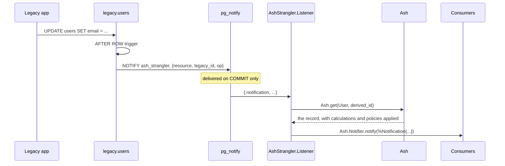

<!--
SPDX-FileCopyrightText: 2026 Luke Galea

SPDX-License-Identifier: MIT
-->

# Notifications

Your LiveView subscribes to `MyApp.Accounts.User` and updates when a user
changes. Then the *legacy* application changes a user, with a plain `UPDATE`
issued by fifteen-year-old code that has never heard of Ash, and the page goes
stale.

AshStrangler closes that gap: a legacy write can be turned into a real
`Ash.Notifier.Notification`, dispatched through Ash's own notifier machinery, so
that consumers cannot tell where the change came from.

This is opt-in, and it is at-most-once. Both of those are deliberate, and the
second one bounds what you may build on top of it.

---

## The mechanism



Four things are worth reading off that diagram before any API.

**The trigger sits on the legacy base table, not on the view.** There is no
choice about this: PostgreSQL rejects row-level `BEFORE` and `AFTER` triggers on a
view outright — *"Views cannot have row-level BEFORE or AFTER triggers"* — and a
statement-level trigger on a view never fires at all unless a row-level
`INSTEAD OF` trigger handled the statement. The base table is the only place this
can live, which is also why it catches writes from the legacy application that
never touch your view.

**The payload carries a key and nothing else.** That is a safety requirement, not
an optimisation. See below.

**The listener re-reads through Ash.** This is the part that makes the resulting
notification indistinguishable from an Ash-originated one: calculations are
computed, field and row policies apply, tenancy applies. It is also why the
payload can afford to be so small — the row data in it would have been thrown
away.

**Delivery happens on commit.** `NOTIFY` does not fire for a rolled-back
transaction, which is correct and what you want.

---

## Turning it on

Notifications are off by default, because they are not free *to the old system*:
every legacy write pays a `pg_notify`, and a full notify queue fails the
transaction that issued it — which is the legacy application's transaction, not
yours.

```elixir
strangler do
  phase :dual_write

  source MyApp.Legacy.Users do
    notify? true
    # notify_channel "my_app_strangler"   # optional; defaults to "ash_strangler"

    key :id, from: :id, strategy: {:uuid_v5, namespace: "6b1e8b2c-…"}
    map :email, from: :email
  end
end
```

`mix ash_strangler.gen.migration` then emits a function and a trigger:

```sql
CREATE OR REPLACE FUNCTION "strangler"."strangler_users_notify"() RETURNS trigger AS $strangler$
DECLARE
  affected record;
BEGIN
  affected := COALESCE(NEW, OLD);

  -- Key only. See the moduledoc: a payload built from row data can exceed
  -- the 7999-byte ceiling and abort the LEGACY application's transaction.
  PERFORM pg_notify('ash_strangler', json_build_object(
    'resource', 'Elixir.MyApp.Accounts.User',
    'legacy_id', affected.id,
    'op', lower(TG_OP)
  )::text);

  -- The return value of an AFTER row trigger is ignored.
  RETURN NULL;
END $strangler$ LANGUAGE plpgsql;

CREATE OR REPLACE TRIGGER "strangler_users_notify"
  AFTER INSERT OR UPDATE OR DELETE ON legacy.users
  FOR EACH ROW EXECUTE FUNCTION "strangler"."strangler_users_notify"();
```

Returning `NULL` is fine here and only here: the return value of an `AFTER` row
trigger is ignored. (In an `INSTEAD OF` trigger the same `RETURN NULL` reports
"0 rows affected" and surfaces as `Ecto.StaleEntryError` — see
[how it works](how-it-works.md#7-instead-of-triggers-only-where-required).)

The `down` statement for the trigger is guarded by `to_regclass`, because this
trigger lives on a relation the package does not own and must not assume still
exists:

```sql
DO $strangler$
BEGIN
  IF to_regclass('legacy.users') IS NOT NULL THEN
    EXECUTE 'DROP TRIGGER IF EXISTS "strangler_users_notify" ON legacy.users';
  END IF;
END $strangler$;
```

One channel serves every resource, with the resource named in the payload,
because PostgreSQL caps a channel name at 63 bytes and a channel-per-resource
would make a listener's `LISTEN` set grow with your schema. The channel name comes
from a compile-time DSL literal and is never interpolated from anything supplied
at runtime — Postgrex has had channel-name escaping CVEs, and a name that cannot
vary cannot carry an injection.

The relation the trigger is attached to is the **twin's** — read off its
`postgres do table/schema end` rather than named a second time in the `strangler`
block. So this mechanism belongs to the phases in which that relation is a real
table: `:read_from_legacy` and `:dual_write`. At `:read_from_new` the migration
generator emits no notify trigger even with `notify? true`, and it has to not:
the legacy name is the reverse *view* by then, and PostgreSQL rejects a row-level
`AFTER` trigger on a view, so emitting it would produce a migration that cannot
run. Nothing is lost — past cutover the writes worth hearing about are Ash's own,
and Ash's notifiers already cover them.

---

## Why the payload is key-only

This is the single most important paragraph on this page.

`pg_notify`'s payload ceiling is **7999 bytes**, measured in bytes rather than
characters, so UTF-8 expansion counts. Exceeding it is a **hard error** — SQLSTATE
`22023`, `payload string too long` — not a truncation. And that error aborts the
transaction that issued the `NOTIFY`, which is **the legacy application's
transaction.**

So a notify trigger that builds its payload out of row data is a latent outage in
the old system, armed and waiting for whoever first pastes a long enough value
into a text field. It will pass every test you write, because your test fixtures
are short.

Since the listener re-reads through Ash anyway, the row data in the payload would
have been thrown away. A key is all that is needed and all that is sent.

The same reasoning applies to the notify queue as a whole. It defaults to 8 GB
(`max_notify_queue_pages`, `postmaster` context), and
`pg_notification_queue_usage()` reports the fraction in use. Monitor it, because a
full queue fails the transaction that issued the `NOTIFY` — which is to say, it
fails the legacy application.

---

## Running the listener

```elixir
# lib/my_app/application.ex
children = [
  MyApp.Repo,
  {AshStrangler.Listener, repo: MyApp.Repo, resources: [MyApp.Accounts.User]},
  MyAppWeb.Endpoint
]

Supervisor.start_link(children, strategy: :one_for_one, name: MyApp.Supervisor)
```

Options are `:repo` (required), `:resources`, `:channel`, `:name`, and the read
options `:actor`, `:tenant` and `:authorize?`.

**A policy-protected resource needs one of those last three**, and this is the
first thing to check when a bridge that should be delivering is not. The listener
is not acting for a person: a legacy write has no Ash actor behind it, so the
`Ash.get/3` that re-reads the row runs as nobody, `Ash.Policy.Authorizer` refuses
it, and `notify/2` returns `:ok` having dispatched nothing. There is no error
anywhere — the only symptom is a page that stops updating.

`authorize?: false` is usually right, and is not the loosening it looks like: the
notification is a system event announcing that a row changed, and every consumer
that renders it re-reads under its own actor. Pass a system actor instead if you
have one and want the re-read itself filtered.

```elixir
{AshStrangler.Listener,
 repo: MyApp.Repo,
 resources: [MyApp.Accounts.User],
 authorize?: false}
```

`:resources` is an allow-list. Omitted, the listener accepts any resource named in
a payload that resolves to a loaded module with a strangler mapping. Naming them
explicitly is the safer choice and is what you want in production. Either way, the
module name in the payload is resolved with `String.to_existing_atom/1` rather than
`String.to_atom/1`: the payload is data from the database, and unbounded atom
creation is a memory leak. A compiled resource module's atom always already exists.

The listener opens its own `Postgrex.Notifications` connection, because `LISTEN` is
session state and cannot share a pooled connection with query traffic.
`AshStrangler.Listener.connection_opts/1` derives the settings from your repo's
config and strips the pooling keys. That stripping is not cosmetic: a repo
configured for tests with `pool: Ecto.Adapters.SQL.Sandbox` cannot be handed to
`Postgrex.start_link/1` at all — it fails with
`Ecto.Adapters.SQL.Sandbox.child_spec/1 is undefined`, because the sandbox is an
Ecto pool rather than a DBConnection one. A listener that works in production and
cannot start under test is a listener nobody tests.

A payload the listener does not understand is logged and dropped. It never crashes
the listener: a malformed or unexpected notification is a reason to look at the
database, not to stop delivering every subsequent one.

---

## What arrives at the other end

```elixir
%Ash.Notifier.Notification{
  resource: MyApp.Accounts.User,
  domain: MyApp.Accounts,
  action: %Ash.Resource.Actions.Update{name: :update, ...},
  data: %MyApp.Accounts.User{...},        # re-read through Ash
  changeset: %Ash.Changeset{...},         # synthesized — see below
  metadata: %{ash_strangler: %{origin: :legacy, legacy_id: 4711}}
}
```

The modern id is computed, not looked up: `AshStrangler.KeyDerivation.derive/3`
applies the same derivation the view's key expression uses, so the listener never
needs a round trip to turn a legacy id into an Ash id. Both sides build the hashed
name through `name_prefix/1`, which is why they cannot drift — and a drift here
would not raise, it would simply find no row.

`:metadata` carries the origin, which is how a consumer that cares can tell a
legacy write from an Ash one.

The `:action` field is the action **struct**, not its name, because
`Ash.Notifier` dereferences `notification.action.name` unconditionally — an atom,
or a `nil`, crashes the dispatch rather than degrading.

Where the resource has a primary action of the matching type it is used, so a
`:dual_write` resource's notifications are indistinguishable from Ash's own and a
`publish :some_action` template keeps naming something real. Where it does not,
the listener synthesizes one named `:legacy_write`.

That fallback is not a nicety. A `:read_from_legacy` read model declares no
create, update or destroy action **by definition** — nothing writes at that phase
— and it is precisely the phase in which the legacy application is the only
writer. Skipping those, which is what this did before, left the bridge inert on
the resource shape it is most useful for.

`:legacy_write` rather than a borrowed name because no Ash action ran, and a
notification that names one would be lying. The consequence is worth stating
because it decides how you write publications: `publish_all :create, [...]`
matches on the action's **type** and therefore fires; `publish :register, [...]`
matches on its **name** and correctly does not.

Two cases resolve differently:

- **A destroy has no row to re-read.** The listener builds a struct carrying just
  the derived key, which is enough for the `:_pkey` topic that a destroy
  notification is normally used for, and is honest about the rest being
  unavailable rather than inventing values.
- **A row that is already gone yields `:ok` and no notification.** By the time a
  notification arrives the row may legitimately have been deleted.

---

## The changeset is synthesized, and it has to be

`Ash.Notifier.PubSub` does not degrade gracefully when a notification has no
changeset. It **raises**. Verified against `ash` 3.31.3:

- a topic template containing `:_pkey` raises `KeyError` on
  `notification.changeset.resource`;
- `:_tenant` raises on `.to_tenant`;
- for an update or destroy, *any* plain attribute key dereferences
  `changeset.data` to compare before-and-after.

`Ash.Notifier.notify/1` dispatches synchronously in the calling process, so that
crash lands in the listener, on every legacy write matching such a publication.

A minimal `%Ash.Changeset{}` carrying resource, action type, data and tenant makes
all of those resolve, and is what the listener builds. It is not a real changeset
and does not pretend to be. **There is no legacy "before" state to put in it**, so
publications using `previous_values?` see the current row on both sides. If your
topic depends on the previous value of a column, a legacy write cannot give you
that, and no amount of work in this listener would change it.

---

## Delivery guarantees, stated plainly

| | |
|---|---|
| **At-most-once** | A listener that is down misses everything sent while it was down. There is no replay and no acknowledgement. |
| **In-memory** | Nothing survives a database restart. |
| **On commit only** | A `pg_notify` inside a rolled-back transaction delivers nothing — correct, and what you want. |
| **Savepoint-safe** | Savepoint rollback discards notifications too, so this is safe inside an `Ecto.Multi` or any subtransaction. |
| **Deduplicated per transaction** | PostgreSQL collapses duplicate `(channel, payload)` pairs within one transaction. |

That last row has a consequence worth stating as its own rule: **a row updated
twice in one transaction produces one event, so this can never be used to count
writes.** It is fine for a listener that re-reads. It is useless as a measure of
write volume, and it is unacceptable as an audit trail. It is also why
`mix ash_strangler.check` tells you to answer *"is the legacy write path dead?"*
with `pg_stat_user_tables` rather than with this.

There is one more deployment constraint, and it is not a detail: **`LISTEN` is
session-scoped and therefore does not work under pgbouncer transaction or
statement pooling.** The listener needs a connection that bypasses the pooler. If
your production database is behind pgbouncer in transaction mode, arrange that
before you turn `notify? true` on, not after.

### Duplicates for Ash's own writes are not suppressed

When Ash writes through the view, the `AFTER` trigger on the base table fires too,
so a consumer sees an Ash-originated change once from Ash's own notifier and once
from this listener.

Suppressing that would mean setting a transaction-local GUC on Ash-originated
writes and having the trigger check it. `SET LOCAL` is transaction-scoped, so it is
pooling-safe — but **`SET LOCAL` outside a transaction block silently does
nothing**, and an AshPostgres repo can be configured with
`prefer_transaction? false`. Suppression would therefore have to force a
transaction on every single write for it to work at all.

The choice made here is not to suppress. A duplicate is harmless to a consumer that
re-reads; a missing write is not.

---

## When to use `ecto_watch` instead

[`ecto_watch`](https://hex.pm/packages/ecto_watch) is mature, adopted, and does
trigger installation plus listen-and-rebroadcast well. Two things kept it out of
this package's dependency tree rather than at the bottom of it:

- it rebroadcasts to `Phoenix.PubSub`, which a schema-mapping library has no other
  reason to depend on;
- it cannot do the part that actually matters here. Re-reading through Ash and
  synthesizing an `Ash.Notifier.Notification` is the whole point, and no generic
  watcher can do it.

Since this package already generates triggers, generating one more is marginal, and
the listener is small and dependency-free.

**If you already run `ecto_watch`, prefer it for the transport.** Its map-form
`schema_definition` can watch a relation in a non-default schema with no Ecto schema
module, which is exactly the legacy case. Then feed what it hands you to the two
public functions here:

```elixir
def handle_info({:updated, MyApp.Accounts.User, %{id: legacy_id}}, socket) do
  AshStrangler.Listener.notify(
    %{resource: MyApp.Accounts.User, legacy_id: legacy_id, op: :update},
    []
  )

  {:noreply, socket}
end
```

`AshStrangler.Listener.decode/2` is public for the same reason — it parses a raw
payload into `%{resource:, legacy_id:, op:}` and validates it against the allow-list,
so a consumer with its own transport does not have to reimplement the safe parsing.

## When notifications are the wrong tool entirely

If what you need is a **complete record** of legacy writes — a compliance audit
trail, a change feed you can replay, anything you intend to reconcile against —
`pg_notify` cannot give it to you, and no configuration of it can. That mechanism
is a synchronous trigger inserting into an events table inside the legacy
transaction, which couples the legacy application's availability to that table's
health. It is a real trade with no correct answer, and it is a decision for you
rather than for this package.

If the new schema lives in a *different* database, none of this applies at all:
that is change data capture, and [Debezium](https://debezium.io/),
[walex](https://github.com/agoodway/walex) or
[ash_replicant](https://hex.pm/packages/ash_replicant) are what you want.

Use this for cache invalidation and LiveView reactivity, where a missed event
costs a stale page until the next read and a duplicate event costs nothing. That
is what it is good at, and it is good enough at it that your users cannot tell
which application wrote the row.
