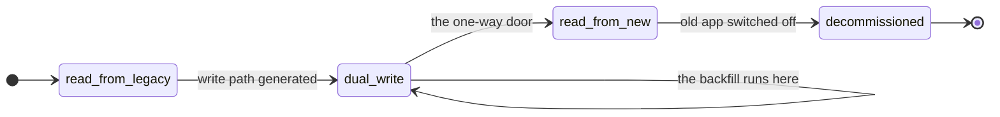
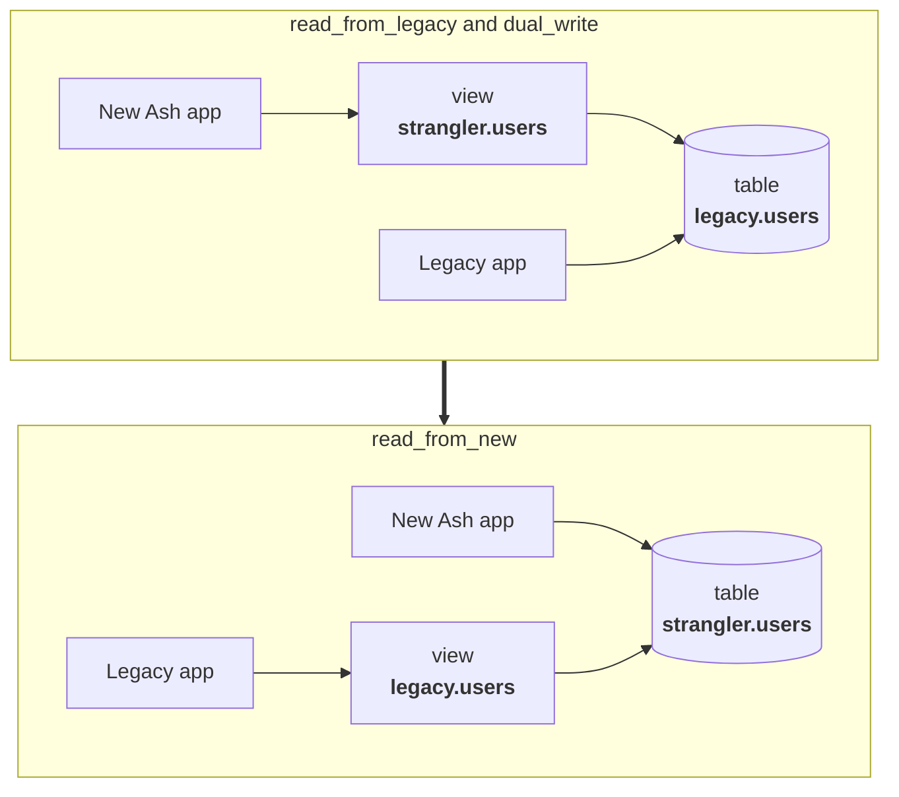

<!--
SPDX-FileCopyrightText: 2026 Luke Galea

SPDX-License-Identifier: MIT
-->

# The phase model

A strangler migration is a sequence of states, not a switch. AshStrangler makes
that sequence explicit: one word on the resource says which state you are in,
and every artifact the package generates is derived from it.

```elixir
strangler do
  phase :dual_write

  source "legacy.users" do
    ...
  end
end
```

Change that word, regenerate the migration, review the diff, run it. That is the
entire interface for moving a resource across. The value is not that it saves
typing — it is that the state of the migration is written down in the codebase,
in a place a reviewer reads, rather than living in someone's head and a runbook.

---

## The four phases at a glance

| | `:read_from_legacy` | `:dual_write` | `:read_from_new` | `:decommissioned` |
|---|---|---|---|---|
| **Source of truth** | legacy tables | legacy tables | the new table | the new table |
| **Compatibility view** | over legacy, named for the modern shape | same | over the new table, named for the **legacy** shape | none |
| **`INSTEAD OF` triggers** | none | only if the mapping requires them | on the legacy-named view, usually required | none |
| **Upserts (`upsert?: true`)** | no write path | available if no trigger was generated | available | available |
| **New app** | reads | reads and writes | owns the data | owns the data |
| **Old app** | unchanged | unchanged | **still unchanged** | switched off |
| **`migrate?`** | `false` | `false` | `true` | `true` |
| **Rollback** | drop the view | drop the triggers | reverse the view definitions | none |



Notice the self-loop. **Backfill is not a phase.** It is an operation that runs
*during* `:dual_write` and must finish before `:read_from_new`. Modelling it as a
phase would imply it is instantaneous; it is the part that takes weeks. See
[Backfill and reconciliation](backfill-and-reconciliation.md).

---

## What each phase generates

`mix ash_strangler.gen.migration` walks every strangler-mapped resource and asks
`AshStrangler.Migration.statements/1` what that resource's phase requires. The
answer is exactly this:

| Phase | Statements emitted |
|---|---|
| `:read_from_legacy` | the compatibility view; the key expression index (for `{:uuid_v5, …}` keys); the notify function and trigger if `notify? true` |
| `:dual_write` | all of the above, plus `INSTEAD OF` insert/update/delete function-and-trigger pairs **when the mapping requires them** |
| `:read_from_new` | the reverse view |
| `:decommissioned` | nothing |

Every generated statement is idempotent (`CREATE OR REPLACE`,
`CREATE INDEX IF NOT EXISTS`), and each is one SQL command, because Ecto sends a
migration's `execute/1` string on the extended protocol and PostgreSQL rejects
multiple commands there with `42601 cannot insert multiple commands into a
prepared statement`. `down` runs the statements in reverse order, since a trigger
cannot outlive the view it is attached to.

### `:read_from_legacy`

The starting point, and the one with no way to lose data. A view wearing the
modern shape is defined over the legacy tables, and the new application reads
through it. Reads, filters, relationships, aggregates and policies all work; the
old application is untouched and does not know the view exists.

Two statements come out of this, and the second one matters more than it looks:

```sql
CREATE OR REPLACE VIEW "strangler"."users" AS
SELECT
  uuid_generate_v5('6b1e8b2c-…'::uuid, 'legacy.users:' || id::text) AS id,
  id                                                                AS __legacy_id,
  (email)::citext                                                   AS email,
  (deleted_at AT TIME ZONE 'UTC')                                   AS archived_at
FROM legacy.users;

CREATE INDEX IF NOT EXISTS strangler_users_key_idx ON legacy.users
  (uuid_generate_v5('6b1e8b2c-…'::uuid, 'legacy.users:' || id::text));
```

Without the expression index every `Ash.get/2` is a sequential scan, because the
lookup is by derived id and no index on `legacy.users (id)` can serve it. The
index expression is built from the same function that builds the view's key
expression rather than being restated, because PostgreSQL will only use the index
if the two match *exactly* — a difference as small as whitespace makes it decline,
silently, and the only symptom is a sequential scan at production data volumes.

The view also exposes `__legacy_id`, the raw legacy key. Nothing reads it in this
phase; every later phase's triggers key off it, so it costs nothing to expose
from the first version of the view.

No write path is generated here. Note that this is a statement about what
AshStrangler emits, not a lock the database enforces: a projection PostgreSQL
considers auto-updatable will accept an `UPDATE` on its plainly-mapped columns
whether or not you meant it to. `:read_from_legacy` is a commitment your
application makes; moving to `:dual_write` is what makes the write path
*designed*.

### `:dual_write`

The same view, plus a way back. This is the phase you spend the most time in: the
new application writes through the view to the legacy tables, the old application
keeps writing to them directly, and both are correct because there is still only
one copy of the data.

**Which write path is generated is derived from the mapping, not fixed.**

| Mapping shape | Write path |
|---|---|
| plain `map :email, "email"` entries only | **nothing generated** — PostgreSQL auto-updates the view |
| any writable computed mapping (`from:` + `to:` + `into:`) | `INSTEAD OF` insert, update and delete triggers |

That derivation lives in `AshStrangler.Info.writes/1`, and `writes :auto` or
`writes :triggers` in the `source` block overrides it. The reason it is derived
rather than "always generate triggers" is that **an `INSTEAD OF` trigger is a
trade, not an addition**. Adding one to an auto-updatable view silently removes
upsert support (`ON CONFLICT DO UPDATE` starts erroring; `ON CONFLICT DO NOTHING`
is accepted and then does nothing at all), correct `RETURNING`, and
`WITH CHECK OPTION` enforcement. It gains governance of every write. A mapping
that does not need governance should not pay for it, and
`AshStrangler.Verifiers.VerifyNoUpserts` rejects `upsert?: true` only on the
resources whose mapping forced a trigger.

Entering this phase tightens one compile-time rule. Under
`AshStrangler.Verifiers.VerifyPhaseTransition`, every `writable? false` mapping
must carry a non-empty `because:`, because in a write phase an unwritable
attribute is a value that will silently not propagate — and that text is what the
generated trigger raises when something attempts the write:

```
ERROR:  cannot write %.%: Not decomposable: 'de la Cruz' splits wrong, and no rule fixes it.
```

This is also the phase in which you run the backfill and the reconciler. Neither
changes what is generated; both are how you earn the right to move on.

### `:read_from_new`

The cutover. A real Ash-owned table now holds the data, and the **legacy name
becomes a view over it**, so the old application's `SELECT * FROM users` keeps
working without a line of its SQL changing.



That symmetry is the payoff of the whole model: **cutover becomes a migration
rather than a coordinated deploy of two systems.**

Because the reverse view projects *backwards*, it can only be built from mappings
that declared an inverse — a `to:`/`into:` pair, or a plain column, which is
bidirectional by construction. It also has to expose the legacy primary key,
which the uuid derivation cannot recover (the hash runs one way), so the resource
must carry a real stored `legacy_id` attribute:

```elixir
attribute :legacy_id, :integer, allow_nil?: false
```

Populating that column is part of the backfill, not of the cutover.

**What the generator deliberately does not emit is the retirement of the old
table.** Turning `legacy.users` into a view requires that `legacy.users` stop
being a table first, which means renaming or dropping real data. That is a
one-way, downtime-shaped operation whose timing depends on facts no generator has
— whether the backfill finished, whether the reconciler is clean, whether anyone
is still writing. You write that step yourself, deliberately, rather than having
it run because a word in the DSL changed.

### `:decommissioned`

Nothing is generated. The old application is gone, the compatibility layer has
been dropped, and the `strangler` block on the resource is vestigial. Deleting
it is the next edit.

---

## Why `migrate?` is `false` in the first two phases and `true` in the last two

`AshStrangler.Verifiers.VerifyNotMigrated` rejects `migrate? true` in
`:read_from_legacy` and `:dual_write`, and says nothing in the other two. That is
not a rule about strangler resources in general — it follows from what the
resource's `table` actually *is* in each phase.

In the first two phases, `postgres do table "users" end` names a **view**. Left at
the AshPostgres default of `migrate? true`, `mix ash.codegen` emits a
`create table` for that name, and the view DDL then tries to create a view over
the same name. `CREATE OR REPLACE VIEW` on an existing table fails, so the
migration cannot run at all — loudly, but only at `mix ash.migrate` time, in
whichever environment ran it first.

The obvious follow-up question is why the compatibility DDL is not simply carried
as `custom_statements` on the resource. Because there is no configuration in
which that works: `AshPostgres.MigrationGenerator` produces snapshots only for
*managed* resources, and `custom_statements` are read from snapshots — so
`migrate? true` collides and `migrate? false` silently discards the view, index
and trigger statements. That is why the DDL has its own mix task. It is also the
position AshPostgres itself takes for view-backed resources: `mix
ash_postgres.gen.resources --include-views` writes `migrate? false` beside a
comment saying migrations for views are handled manually.

At `:read_from_new` the direction flips and so does this. The resource's table is
now a genuine Ash-owned table, and Ash must create and maintain it — so
`migrate? true` is not merely allowed, it is required, and ordinary
`mix ash.codegen` migrations resume being the right tool for the resource's own
schema. `mix ash_strangler.gen.migration` continues to own only the reverse view.

---

## Moving between phases

### `:read_from_legacy` → `:dual_write`

1. Add `because:` to every `writable? false` mapping, and a `to:`/`into:` inverse
   to every computed mapping that should be writable. The compiler will tell you
   which ones.
2. Change the phase, then run `mix ash_strangler.check`. Read the "checks this
   task cannot make for you" section; it is the part that matters.
3. `mix ash_strangler.gen.migration`, review the generated triggers, `mix
   ecto.migrate`.
4. Add the flag column and start the backfill.

Rollback is dropping the triggers and setting the phase back. The data has not
moved; the view is unchanged.

### `:dual_write` → `:read_from_new`

This is the one-way door, and the compiler locks it.
`AshStrangler.Verifiers.VerifyReverseMappable` refuses the phase if any mapping
is `writable? false`, because such a mapping is a written declaration that no
backward direction exists — `full_name` cannot yield back `first_name` and
`last_name`. Emitting the reverse view anyway would mean the old application
reads `NULL` for those legacy columns, silently, starting at the exact moment the
cutover made the new table the source of truth. That is the least recoverable
moment in the entire migration.

The fix is never to delete the verifier. The mapping is telling you the truth:
that data was consumed one-way and the old application still wants it. Carry the
original columns across unchanged as well (map them, even if nothing modern reads
them), or confirm the old application no longer reads them and map them
explicitly, or stop the old application first.

Before you turn the word:

- `AshStrangler.Backfill.pending_count/3` returns `0`.
- `AshStrangler.Reconciler.diff/2` returns `agrees?: true`, and you have read the
  batches rather than the boolean.
- The new table carries `legacy_id` for every row.
- `mix ash_strangler.check` is clean.

Then, in one deliberate migration you write yourself: drop the forward view,
create the Ash-owned table (`mix ash.codegen`, now that `migrate?` is `true`),
move the data, rename the legacy table aside rather than dropping it, and create
the reverse view in its place. Keeping the old table under a different name is
what makes the theoretical rollback — reversing the view definitions — worth
anything at all in the hour after cutover.

### `:read_from_new` → `:decommissioned`

Confirm nothing outside your application still writes to the legacy name, drop
the reverse view, and delete the `strangler` block. There is no rollback, and by
this point there is nothing to roll back to.

---

## Changing a view's shape, in any phase

Two PostgreSQL facts govern how a mapping edit can be shipped, and both are
easier to design around than to discover.

**`CREATE OR REPLACE VIEW` is append-only.** The replacement must produce the
same columns, in the same order, with the same types; it may only *add* columns
at the end. The expressions behind those columns can change completely. So
changing a `cast:` or a `from:` expression is a cheap replace, while renaming an
attribute, changing its type, dropping it, or reordering the select list is a
`DROP VIEW` plus `CREATE VIEW` — a new OID, cascading to dependents.

**Changing a view's shape breaks live prepared statements.** With a prepared
statement open against a view, adding a column and re-executing gives
`ERROR: cached plan must not change result type` (SQLSTATE `0A000`). Postgrex
recovers on its own — it evicts the statement from its per-connection cache and
re-prepares — *except* when the connection is already in a failed transaction,
where the retry is skipped and the error propagates. A view swap landing in the
middle of a `Repo.transaction/1` therefore aborts that transaction rather than
self-healing.

This is also why generated views enumerate their columns explicitly and never
`SELECT *`. A legacy schema is by definition one whose owners still add columns;
with `SELECT *`, every one of their migrations would become a `0A000` storm
across your connection pool.

---

## What the phase cannot tell you

A Spark verifier sees one version of the code and has no memory of the previous
one. It can check that the *current state* is internally consistent — that a key
is declared, that write phases have their `because:` text, that
`:read_from_new` is reversible — and it can never check the *transition*, because
whether a transition is safe depends on the state of the data.

That is what `mix ash_strangler.check` is for, and why it prints the questions it
cannot answer:

```
  1. Is the backfill complete?  Compare row counts between the legacy
     relation and the strangler view. `:read_from_new` with an incomplete
     backfill produces MISSING ROWS, not an error.

  2. Is the legacy write path dead?  Before `:decommissioned`, confirm
     nothing outside this application still writes to the legacy table.

  3. Does the reconciler report drift?  Run it, and read the output rather
     than the exit code.
```

Run it before every phase change. No exceptions.
