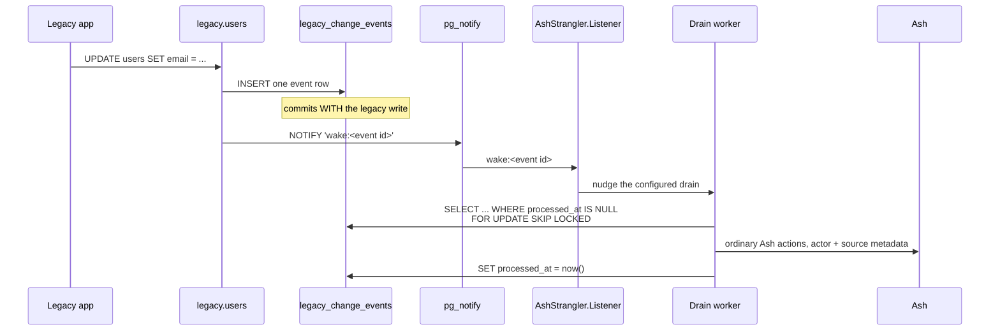

<!--
SPDX-FileCopyrightText: 2026 Luke Galea

SPDX-License-Identifier: MIT
-->

# The change ledger

`notify?` makes a legacy write audible. `ledger?` makes it **undeniable**. They
are one feature — the ledger is the durable record, the notify is the wake that
gets it processed promptly — and this page is about the half a notification can
never give you.

The gap is worth stating as a scenario. A legacy `UPDATE` commits at 02:14. Your
listener is restarting. The `pg_notify` is delivered to nobody, and there is
nothing to recover from: `NOTIFY` is in-memory, at-most-once, and gone. The
cache stays stale, the LiveView stays stale, and no log anywhere says a write
happened. If the write mattered — if it is a compliance-relevant change your new
model must ingest — *prompt* was never the requirement. **Lossless** was, and
no configuration of `pg_notify` provides it.

---

## Durable capture, wake-up delivery

The two mechanisms split the problem the way it actually splits:

| | The ledger (`legacy_change_events`) | The wake (`pg_notify`) |
|---|---|---|
| **Guarantee** | at-least-once | at-most-once |
| **Survives** | the drain being down, restarts, everything | nothing |
| **Costs the legacy app** | a synchronous `INSERT` per write | a queued notify per write |
| **Answers** | "what happened?" | "something happened, look now" |

One `AFTER ... FOR EACH ROW` trigger on the legacy relation does both, in one
function, in the legacy application's own transaction:



The insert is synchronous and first. That is what makes the guarantee real: the
event commits **with** the legacy write or not at all. A rolled-back legacy
write leaves no event, which is correct — there is nothing to ingest. A
committed one has a row before the legacy application's `COMMIT` returns, so a
drain that was down for a week has not missed anything; it has deferred
everything, to rows it can still read.

The wake is second, and its job is only to make ingestion *prompt* instead of
*eventual*. Its payload is `wake:<event id>` — a handful of bytes, the same
7999-byte discipline the notify bridge follows, because exceeding the ceiling is
a hard error that aborts the **legacy application's** transaction. The drain
re-reads the durable row anyway, so the payload carrying anything more would be
a risk with no payoff.

Because one trigger does both, a `ledger?` source announces no JSON envelope on
the channel — the wake replaces it. Downstream consumers do not lose anything
they could have had: the ingestion performs **ordinary Ash actions**, and those
fire Ash's own notifiers, so subscribers still cannot tell where the change came
from. They hear about it one hop later, and can no longer lose it.

---

## Turning it on

```elixir
strangler do
  phase :dual_write

  source MyApp.Legacy.Users do
    notify? true    # the verifier requires it — see below
    ledger? true

    key :id, from: :id, strategy: {:uuid_v5, namespace: "6b1e8b2c-…"}
    map :email, from: :email
  end
end
```

`mix ash_strangler.gen.migration` then emits four statements: the
`legacy_change_events` table, a partial index on unprocessed rows, the trigger
function, and the trigger. The table is **shared infrastructure** — one table
for every relation, with `source_schema`/`source_table` naming where an event
came from, and the function and trigger names derived from `schema.table` so
two resources mapping the same twin share one ledger by construction.

`notify?` is not optional beside `ledger?`, and the verifier refuses the
combination. The ledger is the record; the wake is what gets the record
processed before the sweep gets to it. A record nobody is woken for is a
backlog with a timer on it, and "the drain runs when the cron says" is not what
anyone enabling a change ledger asked for.

The ledger is emitted only while the legacy relation is a real table —
`:read_from_legacy` and `:dual_write`. At `:read_from_new` the legacy name is a
*view*, PostgreSQL rejects row-level `AFTER` triggers on a view outright, and
the verifier refuses `ledger?` there rather than emitting a migration that
cannot run. Nothing is lost: past cutover the writes worth recording are Ash's
own, and Ash's event log records them at their source.

---

## The table, and what each column is for

The trigger fills what only the database knows. Everything else is a slot for
the drain or for supplementary capture:

| Column | Filled by | Note |
|---|---|---|
| `id` | the table | bigserial — the cursor the drain follows and the wake names |
| `source_schema`, `source_table`, `operation` | the trigger | `TG_TABLE_SCHEMA`, `TG_TABLE_NAME`, `lower(TG_OP)` |
| `primary_key` | the trigger | the mapped key column as jsonb — what the listener's derivation consumes |
| `old_row`, `new_row` | the trigger | `to_jsonb(OLD)` / `to_jsonb(NEW)`; `NULL` where there is no image |
| `changed_columns` | the trigger | per-key jsonb comparison; an INSERT's is the whole row |
| `transaction_id` | the trigger | `txid_current()` — one id per legacy transaction, so a multi-row write is reconstructable |
| `transaction_timestamp` | the trigger | `transaction_timestamp()` — the legacy write's own clock, not the drain's |
| `emitted_at` | the table default | `now()` |
| `processed_at` | the drain | the cursor's other half: `NULL` means "not yet ingested" |
| `source_system`, `source_user`, `source_request_id`, `source_correlation_id`, `actor_confidence` | **nobody, yet** | attribution slots; a generic trigger cannot know who the old application's user was, and inventing one would be worse than `NULL` |

`changed_columns` is computed per key with `IS DISTINCT FROM`. An `UPDATE` that
writes a column back with the value it already held **counts as changed** —
that is the honest reading, because PostgreSQL cannot distinguish it from a
write and neither can the trigger. It is the same limitation the
`on_update: :changed_columns` option documents for the `INSTEAD OF` path, seen
from the other side.

---

## Why the table is infrastructure, not a resource

The ledger ships as plain DDL and plain rows. No Ash resource over it comes
with this package, and that is a decision, not an omission.

A resource would invite reading the ledger as domain data — queries, policies,
a LiveView over the events. But the ledger's only job is to be **drained**, and
the drain's policy (which events matter, what to do when ingestion fails, who
acts) is host code by definition: it performs *your* actions on *your*
resources under *your* attribution rules. A library resource in the middle
would either own that policy — which is audit semantics, and out of scope for a
schema-mapping package — or be a hollow pass-through the host must work around.

What the package does ship is the code that drains it: `mix
ash_strangler.gen.ingester MyApp.Accounts.User` generates an ingestion module
(ordinary Ash actions, `actor:` from a `resolve_actor/1` stub, `metadata:`
carrying the source envelope) and an idempotent Oban worker (cursor drain,
`FOR UPDATE SKIP LOCKED`, mark `processed_at` on success). Both are skeletons
in your `lib/`, yours to finish — the column-to-action-input mapping is the one
thing no generator can derive, and the generated code raises where it would
otherwise have to guess.

If you want to query the ledger, wrap it — the schema is plain and stable, and
`AshStrangler.Sql.Ledger.events_table/0` is the one definition of its name.

---

## The drain: at-least-once, and what that demands

The generated worker's loop is one transaction per batch:

1. `SELECT ... WHERE processed_at IS NULL ORDER BY id LIMIT n FOR UPDATE SKIP
   LOCKED` — concurrent workers claim disjoint rows instead of racing, and a
   worker that dies releases its claim with its transaction.
2. Hand each row to the ingestion module, which performs ordinary Ash actions.
3. `SET processed_at = now()` on the batch, commit.

Everything inside one transaction means a claimed event is ingested and marked
exactly once **by that transaction** — provided ingestion talks to the same
database. The moment it also writes to anything outside (a search index, an
HTTP call), the batch stops being atomic and the guarantee is what it always
was: **at-least-once**. A crashed worker replays its batch, so an already-
ingested event arrives twice.

That is not a defect to engineer away; it is the contract to design against.
The ingestion must be idempotent — and the generated skeleton already is on
the axis that matters: it routes a replayed insert to an update, because a row
located by the derived key is either created or updated, never duplicated.

The batch-rolls-back-on-one-poison-event behaviour is deliberate for the same
reason: nothing is marked processed on a failed batch, so the sweep retries it,
and the backlog the `check` task reports is the visible symptom. Dead-lettering
individual rows is a host decision, and the skeleton's comment says where it
goes.

## The sweep is the recovery net

The wake is a hint. A listener that is down misses it; PostgreSQL collapses
duplicate notifications inside one transaction; `LISTEN` does not work under
pgbouncer transaction pooling. None of that can lose an event — the row is
durable — but any of it can **delay** one until the next sweep. That is why the
design pairs them and why the generated worker's moduledoc carries the Oban
config for both:

- the wake (`config :ash_strangler, ledger_drain: {Worker, :nudge}`) makes
  ingestion prompt;
- the cron (`%{cron: "*/5 * * * *", job: Worker}`) makes it *certain*.

Run `mix ash_strangler.check` to see the backlog per relation. A number that
grows between sweeps is not an error — it is the drain telling you it has
stopped keeping up, while there is still time to do something about it.

---

## The trade, stated once more

Before `ledger?: true`, a legacy write depended on: the legacy table being
writable. After it, a legacy write depends on: the legacy table being writable,
**and** `legacy_change_events` accepting an insert.

That second dependency is the price of the guarantee, and it is real. If the
ledger table fills the disk, the old application's writes fail — not the new
one's, the *old* one's. Monitor the table the way you monitor the legacy
database, because it is now part of the legacy write path, size the retention
of processed rows (a housekeeping `DELETE` of `processed_at < now() - interval`
is fine — the drain has consumed them), and treat removing the trigger as the
migration against the old system that it is. `notify?` alone was a cost paid
per write; `ledger?` is a coupling held for as long as the trigger exists.
